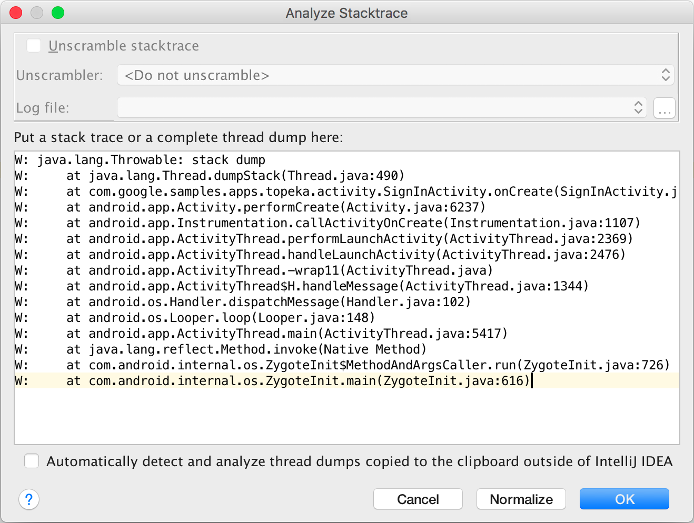
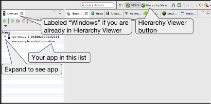
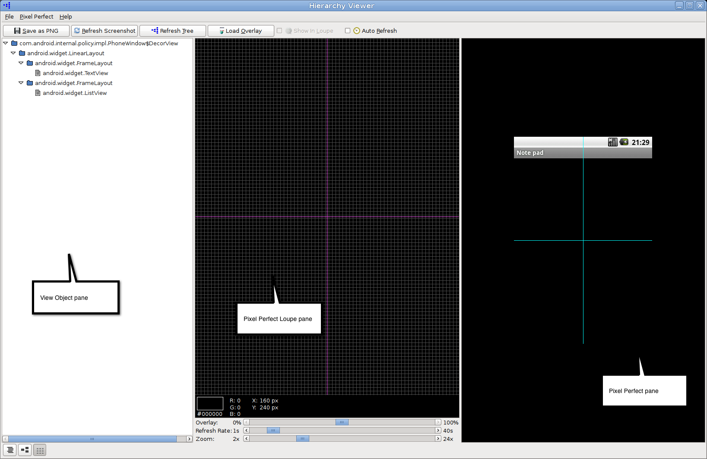
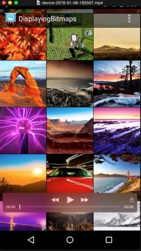
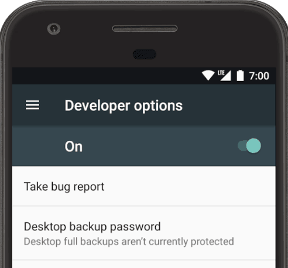
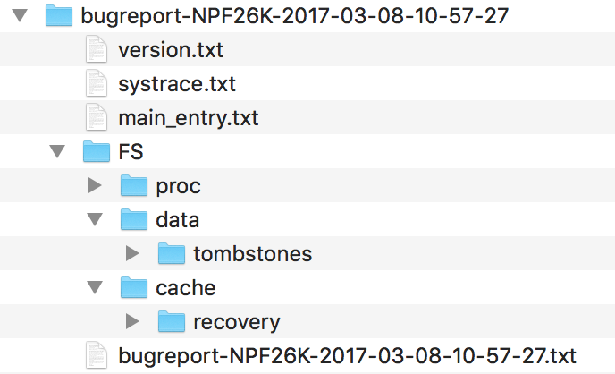

# Analyze a stack trace

Debugging an app often requires working with stack traces. A stack trace is generated whenever your app crashes because of an error or an exception. You can also print a stack trace at any point in your app code using methods such as [`Thread.dumpStack()`](https://developer.android.com/reference/java/lang/Thread.html?hl=ko#dumpStack()).

While your app is running in debug mode on a connected device, Android Studio prints and highlights stack traces in the **logcat** view, as shown in figure 1.


Figure 1. A stacktrace in logcat.

A stack trace shows a list of method calls that lead to the exception being thrown, together with the filenames and line numbers where the calls happened. You can click on the highlighted filenames to open the files and examine the source of the method invocation. Click **Up the stack trace**  and **Down the stack trace**  to quickly move between stack trace lines displayed in the logcat window.

## Open Stack traces from external sources

Sometimes you want to analyze stack traces that were shared with you in a bug report as opposed to those you found while debugging. For example, you might be collecting stack traces generated on your users’ devices from the Google Play Console or from some other tool such as [Firebase Crash Reporting](https://firebase.google.com/docs/crash/?hl=ko).

To get the same highlighted and clickable view of an external stack trace from a bug report, follow these steps:

1. Open your project in Android Studio.

   >  ★ Note: Make sure the source code you're viewing is from the exact same version of your app which generated the stack trace. If the code is different, you will get mismatches between the filenames and line numbers, or the order of calls in the stack trace and your project.

2. **From the **Analyze** menu, click **Analyze Stack Trace**.

   

3. Paste the stack trace text into the **Analyze Stack Trace** window and click **OK**.

4. Android Studio opens a new **<Stacktrace>** tab with the stack trace you pasted under the **Run** window.

   

## Monitor the clipboard for new stack traces

If you work with external stack traces a lot, you can improve your productivity by allowing Android Studio to continuously monitor the system clipboard for new stacktraces:

1. Open the **Analyze Stacktrace** tool.
2. Check the **Automatically detect and analyze thread dumps copied to the clipboard outside of IntelliJ IDEA** checkbox.
3. Copy a stack trace in another application (such as from a web browser) to the system clipboard.
4. When you come back to the Android Studio window, the stack trace opens automatically under the **Run** window, without you having to paste it in the Analyze Stacktrace window.

1. **Analyze Stacktrace** 도구를 엽니다.
2. **intelliJ IDEA 체크박스의 외부 클립보드에 복사된 thread dumps 자동 감지 및 분석 확인 란**을 선택하십시오.
3. 다른 응용 프로그램(예: 웹 브라우저)의 스택 추적을 시스템 클립 보드에 복사합니다.
4. Android Studio 창으로 돌아오면, 스택 추적 창에 붙여 넣지 않아도 **실행** 창 아래에서 스택 추적이 자동으로 열립니다.


# Pixel Perfect!

>  Pixel Perfect is deprecated. Beginning with Android Studio 3.1, you should instead use Layout Inspector to compare your app layout with design mockups, display a magnified view of your app, and examine details of its layout.


Pixel Perfect is a tool built into [Android Device Monitor ](https://developer.android.com/studio/profile/monitor.html?hl=ko)that displays a magnified view of your app so you can inspect the position and properties of individual pixels in your layout, and help match your app's layout to design mockups.

## Start Pixel Perfect

1. Connect your device to your computer. If prompted by a dialog on the device that asks, **Allow USB debugging?**, tap **OK**.

2. Open your project in Android Studio, [build and run it](https://developer.android.com/studio/run/index.html?hl=ko) on your device.

3. Start Android Device Monitor. Android Studio might show a Disable adb integration dialog because only one process can connect to the device via adb at once, and Android Device Monitor is requesting a connection. So click Yes.

   Figure 1 illustrates what initially appears in the Android Device Monitor.

4. In the menu bar, select **Window > Open Perspective**, and then click **Pixel Perfect**.

5. Double-click the device name in the **Windows** tab on the left. This populates the panes with the device display and switches to the **Pixel Perfect Tree** tab.

   

   ​								   Figure1. Android Device Monitor


## Get familiar with the tools

You should see the following three panes:

- **View Object** (left): This is a hierarchical list of the `View` objects visible on the screen, including those owned by the system. When you click a view, its position is highlighted in the Pixel Perfect pane on the right.

- **Pixel Perfect Loupe** (center): This is the magnified screen image. It's overlaid by a grid in which each square represents one pixel. To look at the information for a pixel, click in its square. Its color information and X/Y coordinates appear at the bottom of the pane.

  To zoom, use the **Zoom** slider at the bottom of the pane, or use your mouse's scroll wheel.

- Pixel Perfect (right): This displays the device screen.

  The crosshair in this pane corresponds to the crosshair in the Loupe pane.

  The view selected in the View Object pane is also outlined here in bold red. Sibling and parent views have a light red box.

  The layout box may have other rectangles either inside or outside it, each of which indicates part of the view. A purple or green rectangle indicates the view bounding box. A white or black box inside the layout box represents the view padding. An outer white or black rectangle represents the margins. The padding and margin boxes are white if the layout background is black, and vice versa.

  You can save a screenshot by clicking **Save as PNG** at the top of the window.

  

  Figure 2. The Pixel Perfect window


By default, these panes do not refresh when the UI on the screen changes. To enable auto-refresh, enable **Auto Refresh** at the top of the window, and then set a refresh rate with the **Refresh Rate** slider at the bottom of the Loupe pane.

Otherwise, you can manually refresh the Pixel Perfect pane and the Loupe pane by clicking **Refresh Screenshot** at the top of the window. You also still might need to refresh the View Object pane by clicking **Refresh Tree** at the top of the window.

## Add an overlay image

The Pixel Perfect window helps you match up your app layout to a mockup image by allowing you to load a bitmap as an overlay on the Pixel Perfect window.

To use a bitmap image as an overlay, follow these steps:

- At the top of Pixel Perfect, click **Load Overlay** and select your image.

- Pixel Perfect displays the overlay over the screen in the Pixel Perfect pane. The lower left corner of the bitmap image (X=0, Y=*max value*) is anchored on the lower left-most pixel (X=0, Y=*max screen*) of the screen.

  By default, the overlay has a 50% transparency. You can adjust this with the **Overlay** slider at the bottom of the Loupe pane.

  Also by default, the overlay is not displayed in the Loupe pane. To display it, set **Show in Loupe** at the top of the window.

  


# Take a screenshot

On many Android devices, you can capture a screenshot with a key-combination: Simultaneously press-and-hold Power and Volume-down. You can also capture a screenshot with Android Studio as follows:

1. Run your app on a connected device or emulator. If using a connected device, be sure you have [enabled USB debugging](https://developer.android.com/studio/run/device.html?hl=ko#setting-up).

2. In Android Studio, select **View > Tool Windows > Logcat** to open [Logcat](https://developer.android.com/studio/debug/am-logcat.html?hl=ko).

3. Select the device and a process from the drop-down at the top of the window.

4. Click **Screen Capture**The screenshot appears in a **Screenshot Editor** window.

  > ★ Tip: On Android 7.0 and higher, open Settings, select Developer options > Demo mode, and enable Show demo mode. This resets the status bar to temporarily remove notifications and sets the signal and battery levels to full. For more information, see Configure On-Device Developer Options.


Figure 1. Screenshot editor

5. Optionally change the image.

- **Recapture**: Take a new screenshot.
- **Rotate Left**: Rotate the image 90 degrees counter-clockwise.
- **Rotate Right**: Rotate the image 90 degrees clockwise.
- **Frame Screenshot**: Choose a device to wrap your screenshot with real device artwork. Select **Drop Shadow**, **Screen Glare**, or both to add these effects to your image.

  >  ★ Note: If you select a device for the screenshot frame that differs from the actual device you captured, the editor stretches your image to match the dimensions of the device frame. You instead might want to use the online Device Art Generator, which offers device frames for other popular devices.

6. Click **Save**, specify the location and filename, and then click **OK**.


# Record a video

[Logcat](https://developer.android.com/studio/debug/am-logcat.html?hl=ko) lets you record an MP4 video from your hardware device for a maximum of three minutes. You can, for example, use the video for your marketing materials or for debugging.

Audio is not recorded with the video file.

Video recording is not available for devices running Wear OS.

To record a video of your app, do the following:

1. Open an app project.

2. [Run the app](https://developer.android.com/studio/run/index.html?hl=ko#RunningApp) on a hardware device.

3. Click **View > Tool Windows > Logcat**.

4. Interact with the display on the hardware device to stage the start of the video.

5. Click **Screen Record**  in the left side of the Logcat window.

6. In the **Screen Recorder Options** dialog, set the recording options:

7. - **Bit Rate:** Enter a bit rate. The default is 4 Mbps.
   - **Resolution:** Enter a width and height value in pixels. The value must be a multiple of 16. The default is the resolution of the device.
   - **Show Taps:** Enables visual feedback for taps.

8. Click **Start Recording** to start the recording.

9. Click **Stop Recording** to stop the recording.

10. In the **Save As** dialog, save the MP4 file.

11. In the **Screen Recorder** dialog, click one of the buttons to show the file location, open the recording in a player, or dismiss the dialog.

    

    ​								Figure 1. Record a video of your app


# Capture and read bug reports

A bug report contains device logs, stack traces, and other diagnostic information to help you find and fix bugs in your app. You can capture a bug report from your device by using either the **Take bug report** developer option on the device, the Android Emulator menu, or the `adb bugreport` command on your development machine.

To take a bug report, you must have [Developer options](https://developer.android.com/studio/run/device.html?hl=ko#developer-device-options) enabled on your device so you can access the **Take bug report** option.



​              							  Figure 1. Developer options

## Capture a bug report from a device

To get a bug report directly from your device, do the following:

1. Be sure you have [Developer Options](https://developer.android.com/studio/run/device.html?hl=ko#developer-device-options) enabled.

2. In **Developer options**, tap **Take bug report**.

3. Select the type of bug report you want and tap Report.

   After a moment you get a notification that the bug report is ready (see figure 2).

4. To share the bug report, tap the notification.

   

   ​          						  Figure 2. The bug report is ready


## Capture a bug report from the Android Emulator

From the Android Emulator, you can use the **File a bug** feature in the extended controls:

1. Click **More**  in the emulator panel.

2. In the **Extended controls** window, select **Bug report** on the left.

   This opens a screen where you can see the bug report details such as the screenshot, the AVD configuration info, and the bug report log. You can also type a message with reproduction steps to save with the report.

3. Wait for the bug report to finish collecting, and then click **Save Report**.


## Capture a bug report using adb

If you have just one device connected, you can get a bugreport using [`adb`](https://developer.android.com/studio/command-line/adb.html?hl=ko) as follows:

```
$ adb bugreport E:\Reports\MyBugReports
```

If you do not specify a path for the bugreport, it is saved to the local directory.

If you have multiple devices connected, you must specify the device with the `-s` option. Run the following `adb` commands to get the device serial number and generate the bug report.

```
$ adb devices
List of devices attached
emulator-5554      device
8XV7N15C31003476 device

$ adb -s 8XV7N15C31003476 bugreport
```

## Inspect the bug report ZIP file

By default the ZIP file is called `bugreport-BUILD_ID-DATE.zip` and it it may contain multiple files, but the most important file is `bugreport-BUILD_ID-DATE.txt`. This is the bug report and it contains diagnostic output for system services (`dumpsys`), error logs (`dumpstate`), and system message logs (`logcat`). The system messages include stack traces when the device throws an error, and messages written from all apps with the [`Log`](https://developer.android.com/reference/android/util/Log.html?hl=ko) class.

The ZIP file contains a `version.txt` metadata file that contains the Android release letter, and when systrace is enabled, the ZIP file also contains a `systrace.txt` file. The [Systrace tool](https://developer.android.com/studio/profile/systrace-commandline.html?hl=ko) helps analyze the performance of your application by capturing and displaying execution times of your application processes and other Android system processes.

The `dumpstate` tool copies files from the device’s filesystem into the ZIP file under the `FS` folder so you can reference them. For example, a `/dirA/dirB/fileC` file in the device would generate an `FS/dirA/dirB/fileC` entry in the ZIP file.



​                                 	   Figure 3. Bug report file structure

For more information, see [Reading bug reports](https://source.android.com/source/read-bug-reports.html?hl=ko).

## Get reports from your users

Capturing bug reports as described above is helpful as you're using the app yourself, but your end-users can't easily share these types of bug reports with you. To get crash reports with stack traces from real-world users, you should take advantage of Google Play's and Firebase's crash reporting features.

### Google Play Console

You can get reports from the [Google Play Console](https://play.google.com/apps/publish/?hl=ko) to view data for crashes and application not responding (ANR) errors from users who installed your app from Google Play. Data is available for the previous six months.

For more information, see [View crashes & application not responding (ANR) errors](https://support.google.com/googleplay/android-developer/answer/6083203?hl=en&ref_topic=7071935) in Play Console help.

### Firebase crash reporting

Firebase crash reporting creates detailed reports of the errors in your app. Errors are grouped into issues based on having similar stack traces, and triaged by the severity of impact on your users. In addition to automatic reports, you can log custom events to help capture the steps leading to a crash.

You'll start receiving crash reports from any user by simply adding the Firebase dependencies to your `build.gradle` file. For more information, see [Firebase crash reporting](https://firebase.google.com/docs/crash/?hl=ko).

