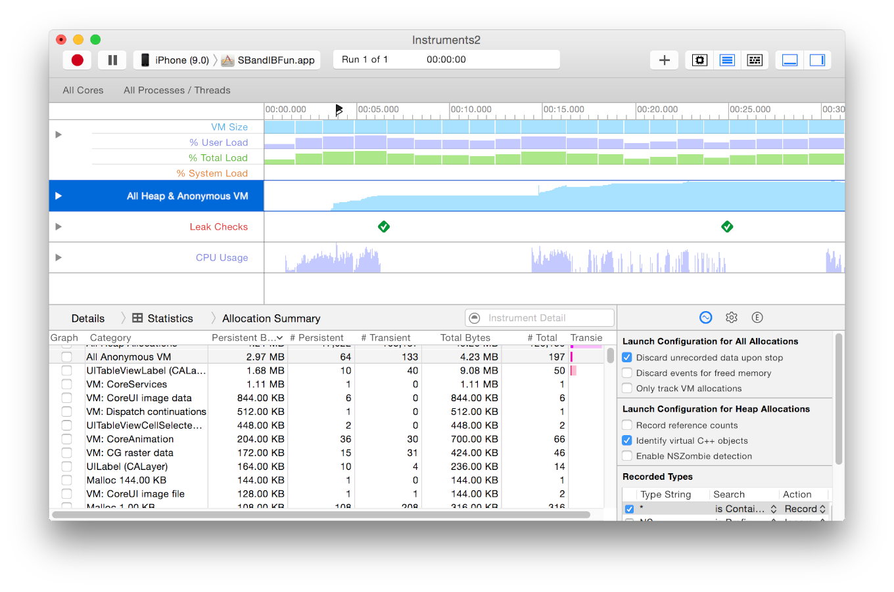
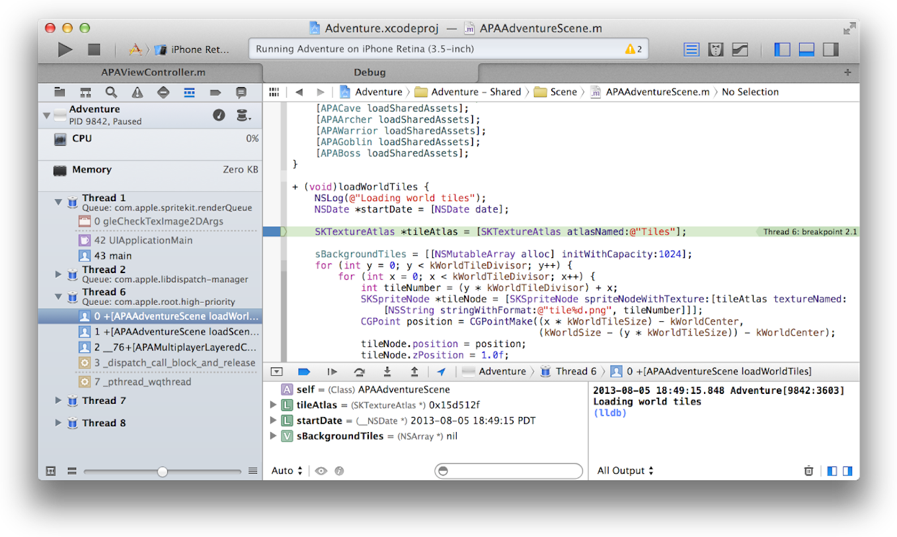

## 4. Measuring Performance

## 성능 측정하기

The Instruments app, which is included with Xcode, gathers data from your running app and presents it in a graphical timeline. With Instruments, you can gather data about performance areas such as your app’s memory usage, disk activity, network activity, and graphics operations. By viewing the data together, you can analyze different aspects of your app’s performance to identify potential areas of improvement. You can also automate the testing of your iOS app’s user interface elements.

Xcode에 포함되어있는 Instruments(측정 도구들. 영어로 측정 기구, 기계를 뜻함) app은 실행중인 앱에서 데이터를 모으고, 그래픽 시간순서로 모아진 데이터를 보여준다. 측정 기능들로 당신 앱의 메모리 사용량, 디스크 활동, 네트워크 활동, 그래픽 연산과 같은 성능 측면에 대한 데이터를 얻을 수 있다. 또한 데이터를 함께 봄으로써, 앱의 성능을 개선할 수 있는 잠재적안 부분을 명확히파악하는 등 다양한 측면을 분석할 수 있다다. 또한 IOS 앱안의 UI 요소 테스트들을 자동화할 수 있습니다.

There are several ways to start Instruments from Xcode. For example:

- Click the Profile in Instruments button from a debug gauge report.
- Choose Product > Profile.
- Specify an Instrument in the Profile action for a scheme.

Xcode에서 성능 측정 도구들을 시작하는 여러 가지 방법이 있다. 

- 디버그 게이지 리포트에서 Instruments 버튼 안의 Profile을 클릭한다.
- Product → Profile을 클릭한다.
- Scheme에 Profile 활동 안의 Instrument를 명시한다.

The Instruments app uses individual data collection modules, known as *instruments*, to gather data about a process over time. The Instruments app includes a library of templates. Each template contains instruments for obtaining a set of related information. The following figure shows the template selection that is displayed when you launch instruments for an app.

Intruments app은 앱의 실행 과정 전체의 데이터를 모으는 데이터 수집 모듈들을 사용할 수 있다. Instruments앱은 템플릿들을 포함하고 있다. 각 템플릿은 연관된 정보의 얻는데 사용되는 Instrument들을 포함한다. 다음 사진은 Instruments 앱을 시작할 때 보여지는 템플릿 모음을 보여준다.

After running a session, the Instruments window shows all the data for each instrument and provides many ways to explore the data.

앱을 실행하고 난 후에, Instruments 창은 각 Instrument에 대한 모든 데이터를 보여주고, 이 데이터들을 둘러보는 많은 방법들을 제공한다.

For more detailed information, see Performance Overview and Instruments User Guide.

좀 더 자세한 정보를 위해서는, [Performance Overview](https://developer.apple.com/library/archive/documentation/Performance/Conceptual/PerformanceOverview/Introduction/Introduction.html#//apple_ref/doc/uid/TP40001410) 와 [Instruments User Guide](https://developer.apple.com/library/archive/documentation/DeveloperTools/Conceptual/InstrumentsUserGuide/index.html#//apple_ref/doc/uid/TP40004652)를 참고하라.

## 5. Simulating Problems

## 5. 시뮬레이터에 관련된 문제들

Simulator helps you find major problems in your app during design and early testing. For example, the Debug menu in Simulator offers tools that help you:

- Slow an animation to spot any problems
- Change the graphics quality
- Trigger iCloud sync
- Identify blended view layers that harm app performance
- Identify images whose source pixels aren’t aligned to the destination pixels
- See what content is rendered offscreen
- Simulate different locations

시뮬레이터는 디자인과 초기 테스트를 하는 동안 앱에서 문제점들을 찾을 수 있게 도와준다. 예를 들어 시뮬레이터의 Debug 메뉴는 다음과 같은 도구들을 제공한다.

- 어떤 문제들을 발견하기 위해 앱 상황을 느리게 진행한다.
- 그래픽 퀄리티를 변경한다.
- iCloud 동기화를 시작한다.
- 앱 성능에 해가 되는 복잡한(혼합된) view 레이어들을 명확히 알려준다.
- 이미지 소스 픽셀들이 제대로 정렬되지 않은 이미지들을 명확히 알려준다.
- 화면에 렌더링되는 콘텐츠를 보여준다.
- 다른 위치에서 가상으로 앱을 실행한다.

In every simulated environment in Simulator, the Home screen provides access to apps—such as Settings, Contacts, Maps, and Passbook—that are included with an iOS or watchOS device. You can perform preliminary testing of your app’s interaction with these apps in Simulator. For example, if you are testing a game, use Simulator to test that the game uses Game Center correctly.

시뮬레이터 내의 모든 가상 환경에서, 홈 스크린은 IOS또는 watchOS 장비의 앱들(세팅, 연락처, 지도, 결제 정보와 같은 것)에 대한 접근 권한을 제공한다. 당신은 시뮬레이터에서 이 앱들과 당신 앱들에 대한 상호작용 예비 테스트를 수행할 수 있다. 예를 들어, 만일 당신이 게임을 테스트한다면, 게임이 게임 센터를 정확하게 사용하는지 테스트하기 위해 시뮬레이터를 이용해라.

The Accessibility inspector in Simulator helps you test the usability of your app regardless of a person’s limitations or disabilities by displaying information about each accessible element in your app. The inspector also enables you to simulate VoiceOver interaction with those elements. To start the Accessibility inspector, click the Home button in Simulator. Click Settings and go to General > Accessibility. Slide the Accessibility Inspector switch to On.

시뮬레이터에서 Inspector는 앱 안에서 접근할 수 있는 각 요소에 대한 정보를 게시함으로써, 사용자의 제한이나 장애에 관계 없이 앱의 이용성을 테스트하는 것을 돕는다. inspector는 이러한 장애 요소들과 같이 VoiceOver가 잘 작동하는지 테스트할 수도 있다. Inspector를 시작하기 위해서는 시뮬레이터에서 Home 버튼을 눌러라. Setting을 누르고 General > Accessibility를 클릭해라. Inspector 접근을 On으로 밀어서 활성화해라.

You can test your app’s localizations in Simulator by changing the language. In Settings, go to General > International > Language.

기기의 언어를 바꾸는 것을 통해 시뮬레이터의 지역화를 테스트 할 수 있다. 세팅에서 General > International > Language로 이동하라.

Although you can test your app’s basic behavior in Simulator, the simulator is limited as a test platform for multiple reasons. For example:

- Because Simulator is an app running on a Mac, Simulator has access to the computer’s memory, which is much greater than the memory found on a device.
- Simulator runs on the Mac CPU rather than the processor of an iOS or watch OS device.
- Simulator doesn’t run all threads that run on devices.
- Simulator can’t simulate hardware features like the accelerometer, gyroscope, camera, or proximity sensor.

비록 시뮬레이터에서 앱의 기본적인 것들을 테스트할 수 있다고 할 지라도, 시뮬레이터는 다양한 이유 때문에 테스트 플랫폼으로서 제한이 있다. 예를 들면 :

- 시뮬레이터는 기본적으로 Mac에서 동작한다. 시뮬레이터는 컴퓨터 메모리에 접근할 수 있다. 그리고 시뮬레이터가 사용하는  메모리는 실제 장비에서 사용하는 것보다 훨씬 많이 사용된다.
- 시뮬레이터는 Ios 또는 watchOS 장비의 프로세스가 아닌 Mac CPU에서 실행된다.
- 시뮬레이터는 실제 기기에서 실행하는 모든 스레드를 실행하지 않는다.
- 시뮬레이터는 가속도계, 자이로스코프, 카메라 또는 근접 센서와 같은 하드웨어 기능을 실행할 수 없다.

While developing your app, run and test it on all of the devices and OS versions that you intend to support.

앱을 개발하는 동안 네가 지원하길 원하는 모든 장비들과 OS 버전에서 테스트하고 실행하라.

For more detailed information, see [Testing and Debugging in Simulator](https://developer.apple.com/library/archive/documentation/IDEs/Conceptual/iOS_Simulator_Guide/TestingontheiOSSimulator/TestingontheiOSSimulator.html#//apple_ref/doc/uid/TP40012848-CH4).

더 많은 정보를 위해서는 해당 링크를 참고하라.

## 6. Customizing Your Workflow

## 6. 작업 과정 커스터마이징하기

Specify behaviors that affect your workflow through the Xcode Behaviors preferences. Choose Xcode > Behaviors to specify what should happen when a variety of events occur while building, running, and debugging your app.

Xcode Behaviors 환경 설정에서 너의 작업 과정에서 중요한 작업들을 설정해라. 앱을 빌딩하고 실행하고, 디버깅하는 동안 다양한 이벤트가 일어날 때, 수행할 작업 과정을 설정하려면 Xcode > Behaviors 를 선택해라.

For example, Xcode can display the debug area when your code pauses at a breakpoint, and it can display the issue navigator when a build fails.

예를 들어, Xcode는 너의 코드가 breakpoint에서 멈출 때 debug 영역을 보여줄 수 있고, 빌드가 실패했을 때 issue navigator를 보여줄 수 있다.

In the screenshot below, behaviors are customized for whenever the code pauses. Here are some examples of customized behaviors:

- Play an alert sound at every pause.
- Create a tab named Debug in the workspace window for displaying the debug navigator.
- Show both the variables view and the console view in the Debug tab.
- Hide the utilities area in the Debug tab.

아래의 스크린샷에서, behaviors는 code가 멈추는 시점에 일어날 작업 과정이 커스터마이징되어있다. 커스터마이즈된 behaviors의 몇 가지 예시가 있다.

- 모든 일시정지 상황 때마다 경고음을 실행한다.
- workspace 창에 debug navigator를 보여주는 Debug라는 이름의 탭을 만든다.
- Debug 탭에서 variables, console 화면을 모두 보여준다.
- Debug tab에서 uitilities 영역을 숨긴다.

As a result, when the code in the project hits a breakpoint, Xcode creates a Debug tab in the workspace window with the specified content.

결과적으로 프로젝트 안의 코드가 breakpoint에서 멈출 때, Xcode는 명시된 컨텐츠와 함께 workspace 창 안에 debug tab을 만든다.

You can design custom behaviors that are triggered by menu items or their keyboard equivalents. Choose Xcode > Preferences, select the Behaviors preferences pane, and click the Add button (+) at the bottom of the pane. Type the name of the new behavior, and press Return. Select checkboxes to specify what should happen when you invoke this behavior. For example, create a Unit Testing behavior that saves a snapshot of your project and runs your unit tests. After you’ve created a behavior, it appears in the Xcode > Behaviors menu.

메뉴 아이템들이나 키보드 동작과 같은 것들에 의해 일어나는 사용자 지정 동작을 설계할 수 있다. Xcode > Preferences를 누르고, 동작 설정 화면 메뉴를 선택한 뒤, 화면 아래의 Add 버튼을 눌러라. 새로운 사용자 지정 동작의 이름을 기입하고, Return 버튼을 눌러라. 이 동작이 호출될 때 일어날 작업들을 명확하게 설정하기 위해 체크박스를 선택해라. 예를 들어, 프로젝트의 스냅샷을 저장하고 유닛 테스트들을 실행하는 Unit Testing 동작을 생성해보자. 이 동작을 만든 후, 이 동작은 Xcode > Behaviors 메뉴에서 확인할 수 있다.

To assign a keyboard equivalent to a custom behavior, choose Xcode > Preferences and click Key Bindings. In the Key Bindings preferences pane, select the Customized tab to find the custom behavior you want. In the text field, enter the keys you want to use for the key binding in the text field, and click outside the text field to complete the operation.

사용자 지정 동작에 키보드 동작을 할당하려면, Xcode > Preferences 를 선택하고 Key Bingings를 선택해라. Key Bindings preferences 화면에서 네가 원하는 사용자 지정 동작을 찾기 위해 Customized 탭을 선택해라. 텍스트 필드에서 네가 텍스트 필드와 연결하길 원하는 키를 누르고 동작을 마무리하기위해 텍스트 필드 바깥을 선택해라.

For more detail on types of breakpoints and breakpoint actions, see [Xcode Help](https://help.apple.com/xcode).

breakpoints와 breakpoint의 타입들에 대해 더 자세히 알려면 Xcode Help를 보아라