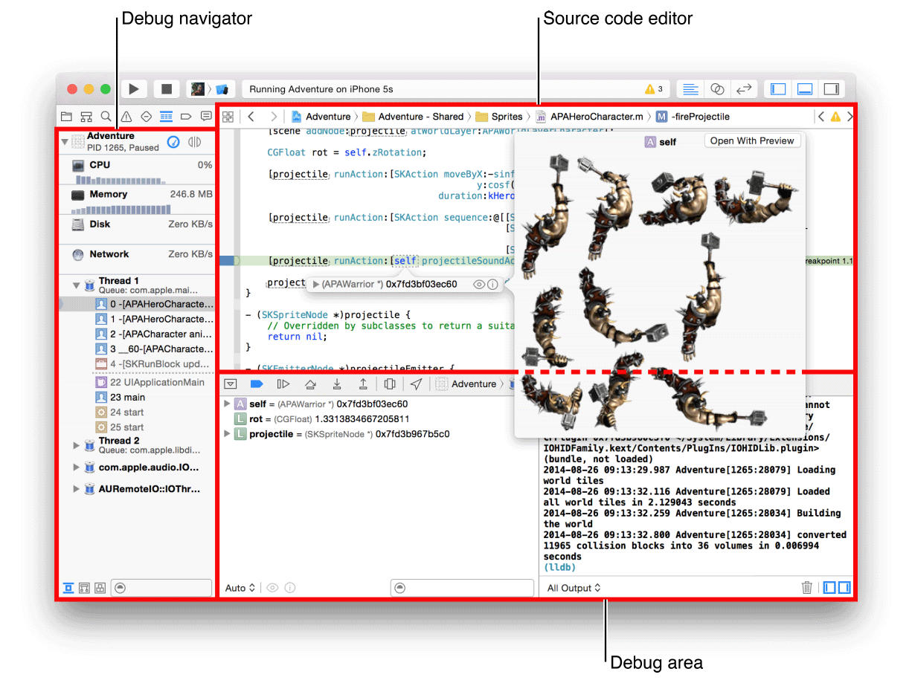
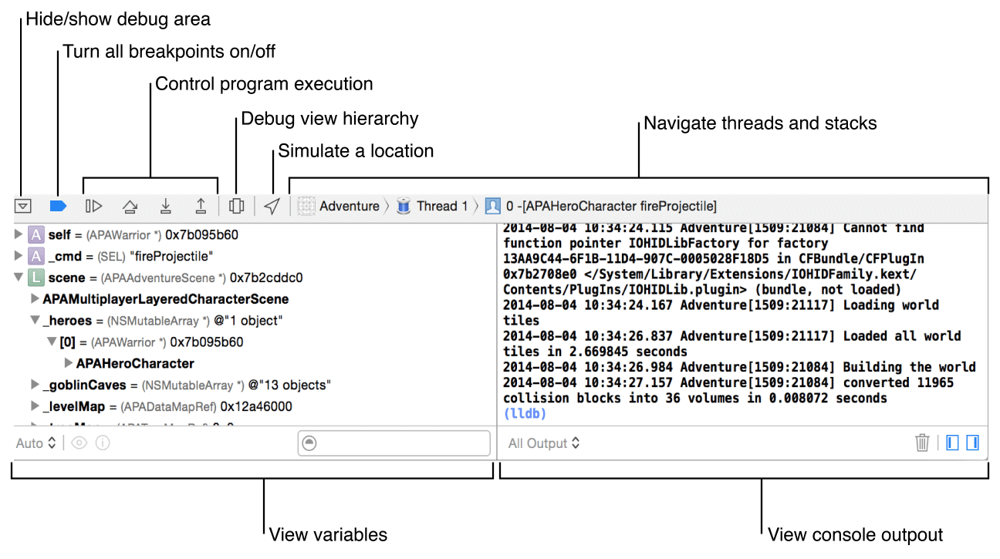
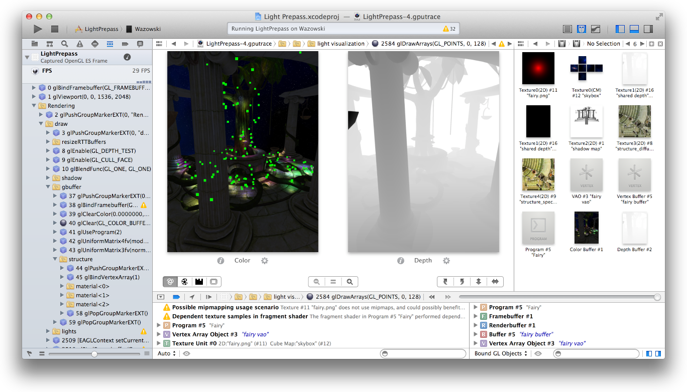
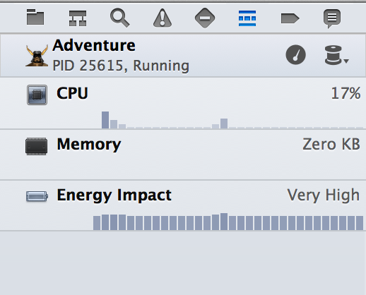
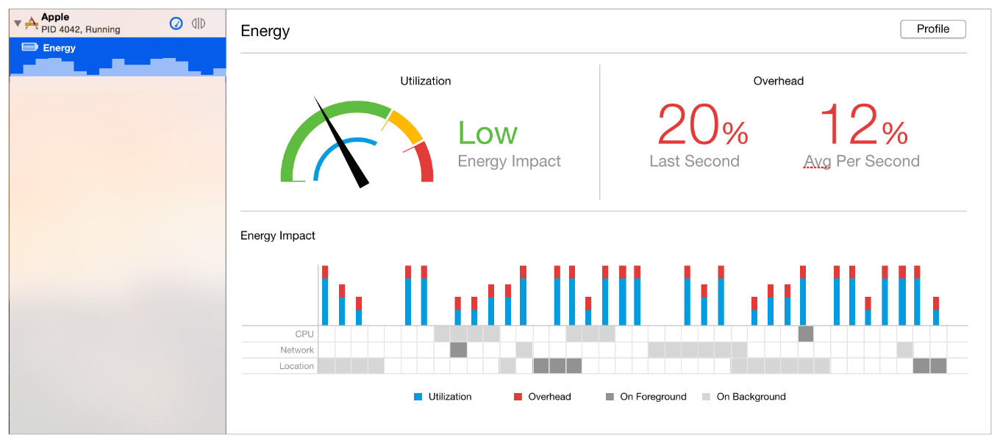
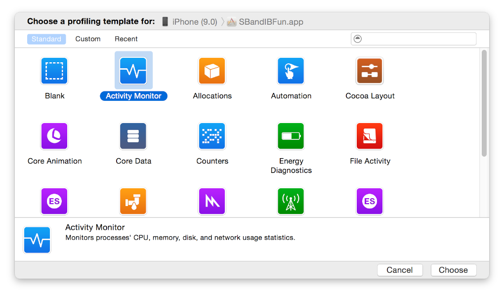

## 1. Using the Debugger

After you click the Run button in the workspace toolbar and your app builds successfully, Xcode runs your app and starts a debugging session. You can debug your app directly within the source editor with graphical tools such as data tips and Quick Look for the value of variables.

The debug area and the debug navigator let you inspect the current state of your running app and control its execution.

Creating a quality app requires that you minimize your app’s impact on your users’ systems. Use the debug gauges in the debug navigator to gain insight into your app’s resource consumption, and when you spot a problem, use Instruments to measure and analyze your app’s performance. Use the energy guides to minimize your impact on battery life. For more information, see *Energy Efficiency Guide for iOS Apps* and *Energy Efficiency Guide for Mac Apps*.

If you are developing an iOS or watchOS app, use Simulator to find major problems during design and early testing.

You can configure Xcode to help you focus on your debugging tasks. For example, when your code hits a breakpoint, you can make Xcode automatically play an alert sound and create a window tab named Debug, where Xcode displays the debug area, the debug navigator, and your code at the breakpoint.

### Controlling Execution

Xcode lets you step through your code line by line to view your program’s state at a particular stage of execution. Use the debug area to control the execution of your code, view program variables and registers, view its console output, and interact with the debugger. You can also use the debug area to navigate the OpenGL calls that render a frame and to view the rendering-state information at a particular call.

Display the debug area by clicking the center button () in the view selector in the workspace window toolbar.

You can suspend the execution of your app by clicking the pause button (which toggles between  to pause and  to continue) in the debug area toolbar. To set a breakpoint, open a source code file and click the gutter next to the line where you want execution to pause. A blue arrow () in the gutter indicates the breakpoint. For more information on breakpoints, including how to set breakpoint actions and the different kinds of breakpoints, see [Xcode Help](https://help.apple.com/xcode).

When your app is paused, the currently executing line of code is highlighted in green. You can step through execution of your code using the Step Over (), Step Into (), and Step Out () buttons located in the bar at the top of the debug area. Step over will execute the current line of code, including any methods. If the current line of code calls a method, step into starts execution at the current line, and then stops when it reaches the first line of the called method. Step out executes the rest of the current method or function.

### Viewing State Information

When execution pauses, the debug navigator opens to display a stack trace. Select an item in the debug navigator to view information about the item in the editor area and in the debug area. As you debug, expand or collapse threads to show or hide stack frames.

Hover over any variable in the source code editor to see a data tip displaying the value for the variable. Click the Inspector icon () next to the variable to print the Objective-C description of the object to the debug area console and to display that description in an additional popover.

Click the Quick Look icon () to see a graphical display of the variable’s contents. You can implement a custom Quick Look display for your own objects. See *Quick Look for Custom Types in the Xcode Debugger*.

### Finding Memory Corruption

Memory corruption crashes can be hard to reproduce and even harder to find. Address sanitizer adds instrumentation to your app that enables Xcode to stop your app where the corruption happens. Address sanitizer finds problems such as accessing deallocated pointers, buffer overflow and underflow of the heap and stack, and other memory issues.

To use address sanitizer, enable it in the debug scheme for your target, then run and use the app. Xcode monitors memory use and stops your app on the line of code causing the problem and opens the debugger. Use the debugger to isolate the cause.

For more information on using address sanitizer, see [Using the Address Sanitizer](https://developer.apple.com/library/archive/documentation/DeveloperTools/Conceptual/debugging_with_xcode/chapters/special_debugging_workflows.html#//apple_ref/doc/uid/TP40015022-CH9-SW23)

### Debugging Metal

Metal takes full advantage of modern GPUs so your apps can give the best user experience. You can use Metal to accelerate both graphics and computation, all using a streamlined API. For information on debugging Metal, see [Metal Tips and Techniques](https://developer.apple.com/library/archive/documentation/Miscellaneous/Conceptual/MetalProgrammingGuide/Dev-Technique/Dev-Technique.html#//apple_ref/doc/uid/TP40014221-CH8). For general information, see [Metal for Developers](https://developer.apple.com/metal/) on the developer website and *Metal Programming Guide*.

### Debugging OpenGL

When you build and run an OpenGL ES app on a connected device, the debug area toolbar includes a Frame Capture button (). Click that button to capture a frame. You can use OpenGL ES frame capture to:

- Inspect OpenGL ES state information
- Introspect OpenGL ES objects such as view textures and shaders
- Step through the state calls that precede each draw call and watch the changes with each call
- Step through draw calls to see exactly how the image is constructed
- See in the assistant editor which objects are used by each draw call
- Edit shaders to see the effect upon your app

The screenshot shows the use of the debugger to view components of a rendered frame. The debug navigator on the left shows parts of the rendering tree, and the main debug view shows the color and depth sources for the rendered frame as well as other image sources.

For more help debugging OpenGL ES, see related items in [Xcode Help](https://help.apple.com/xcode) and [Xcode Help](https://help.apple.com/xcode).

## 2. Examining the View Hierarchy

Click the Debug View Hierarchy button () in the bar at the top of the debug area to inspect a 3D rendering of the view hierarchy of your paused app. You can:

- Rotate the rendering by clicking and dragging in the canvas.
- Increase or decrease the spacing between the view layers using the slider on the lower left.
- Change range of visible views using the double ended slider on the lower right. Move the left handle to change the bottommost visible view. Move the right handle to change the topmost visible view.

- Reveal any clipped content of the selected view by clicking the Show clipped content button ().
- Reveal any Auto Layout constraints of the selected view by clicking the Show constraints button ().
- Increase and decrease the magnification using the Zoom In (+) and Zoom Out (-) buttons.

For more help debugging views, see [Debugging View Hierarchies](https://developer.apple.com/library/archive/documentation/DeveloperTools/Conceptual/debugging_with_xcode/chapters/special_debugging_workflows.html#//apple_ref/doc/uid/TP40015022-CH9-SW2).

## 3. Examining System Impact

The debug navigator displays gauges that provide insight into how your app is performing. For example, the CPU gauge shows a readout of your app’s CPU usage, making it easy to spot unexpected spikes. Depending on the capabilities of your app and the characteristics of its destination, gauges can report your app’s impact on memory, iCloud, OpenGL ES, energy, and the CPU.

To see a full report, click a gauge in the debug area. To perform a deeper analysis of your app’s performance, click the Profile in Instruments button.

For problem areas, the energy report offers a preliminary diagnosis of what may be plaguing your app.

For more help, see Using Debug Gauges.

## 4. Measuring Performance

The Instruments app, which is included with Xcode, gathers data from your running app and presents it in a graphical timeline. With Instruments, you can gather data about performance areas such as your app’s memory usage, disk activity, network activity, and graphics operations. By viewing the data together, you can analyze different aspects of your app’s performance to identify potential areas of improvement. You can also automate the testing of your iOS app’s user interface elements.

There are several ways to start Instruments from Xcode. For example:

- Click the Profile in Instruments button from a debug gauge report.
- Choose Product > Profile.
- Specify an Instrument in the Profile action for a scheme.

The Instruments app uses individual data collection modules, known as *instruments*, to gather data about a process over time. The Instruments app includes a library of templates. Each template contains instruments for obtaining a set of related information. The following figure shows the template selection that is displayed when you launch instruments for an app.

After running a session, the Instruments window shows all the data for each instrument and provides many ways to explore the data.

For more detailed information, see Performance Overview and Instruments User Guide.

## 5. Simulating Problems

Simulator helps you find major problems in your app during design and early testing. For example, the Debug menu in Simulator offers tools that help you:

- Slow an animation to spot any problems
- Change the graphics quality
- Trigger iCloud sync
- Identify blended view layers that harm app performance
- Identify images whose source pixels aren’t aligned to the destination pixels
- See what content is rendered offscreen
- Simulate different locations

In every simulated environment in Simulator, the Home screen provides access to apps—such as Settings, Contacts, Maps, and Passbook—that are included with an iOS or watchOS device. You can perform preliminary testing of your app’s interaction with these apps in Simulator. For example, if you are testing a game, use Simulator to test that the game uses Game Center correctly.

The Accessibility inspector in Simulator helps you test the usability of your app regardless of a person’s limitations or disabilities by displaying information about each accessible element in your app. The inspector also enables you to simulate VoiceOver interaction with those elements. To start the Accessibility inspector, click the Home button in Simulator. Click Settings and go to General > Accessibility. Slide the Accessibility Inspector switch to On.

You can test your app’s localizations in Simulator by changing the language. In Settings, go to General > International > Language.

Although you can test your app’s basic behavior in Simulator, the simulator is limited as a test platform for multiple reasons. For example:

- Because Simulator is an app running on a Mac, Simulator has access to the computer’s memory, which is much greater than the memory found on a device.
- Simulator runs on the Mac CPU rather than the processor of an iOS or watch OS device.
- Simulator doesn’t run all threads that run on devices.
- Simulator can’t simulate hardware features like the accelerometer, gyroscope, camera, or proximity sensor.

While developing your app, run and test it on all of the devices and OS versions that you intend to support.

For more detailed information, see [Testing and Debugging in Simulator](https://developer.apple.com/library/archive/documentation/IDEs/Conceptual/iOS_Simulator_Guide/TestingontheiOSSimulator/TestingontheiOSSimulator.html#//apple_ref/doc/uid/TP40012848-CH4).

## 6. Customizing Your Workflow

Specify behaviors that affect your workflow through the Xcode Behaviors preferences. Choose Xcode > Behaviors to specify what should happen when a variety of events occur while building, running, and debugging your app.

For example, Xcode can display the debug area when your code pauses at a breakpoint, and it can display the issue navigator when a build fails.

In the screenshot below, behaviors are customized for whenever the code pauses. Here are some examples of customized behaviors:

- Play an alert sound at every pause.
- Create a tab named Debug in the workspace window for displaying the debug navigator.
- Show both the variables view and the console view in the Debug tab.
- Hide the utilities area in the Debug tab.

As a result, when the code in the project hits a breakpoint, Xcode creates a Debug tab in the workspace window with the specified content.

You can design custom behaviors that are triggered by menu items or their keyboard equivalents. Choose Xcode > Preferences, select the Behaviors preferences pane, and click the Add button (+) at the bottom of the pane. Type the name of the new behavior, and press Return. Select checkboxes to specify what should happen when you invoke this behavior. For example, create a Unit Testing behavior that saves a snapshot of your project and runs your unit tests. After you’ve created a behavior, it appears in the Xcode > Behaviors menu.

To assign a keyboard equivalent to a custom behavior, choose Xcode > Preferences and click Key Bindings. In the Key Bindings preferences pane, select the Customized tab to find the custom behavior you want. In the text field, enter the keys you want to use for the key binding in the text field, and click outside the text field to complete the operation.

For more detail on types of breakpoints and breakpoint actions, see [Xcode Help](https://help.apple.com/xcode).
