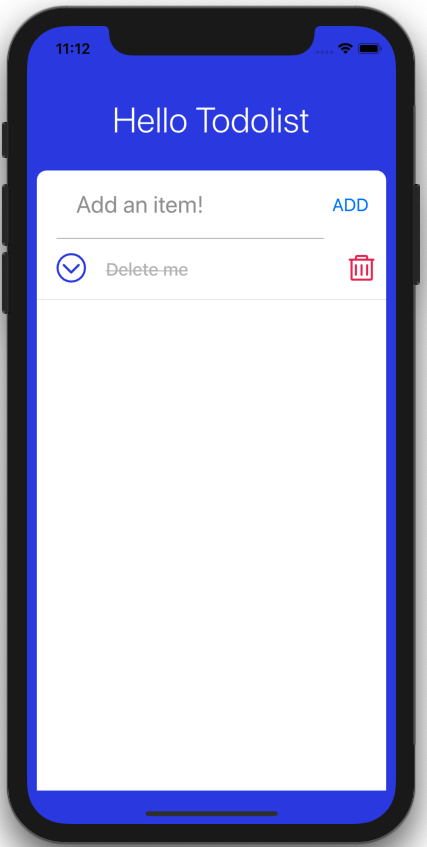

## 할 일 목록 삭제하기

할 일 목록을 삭제하는 함수를 만들겠습니다.

app.js 파일에서 `onRemove` 함수를 생성합니다.

```js
const onRemove = id => e => {
    setTodos(todos.filter(todo => todo.id !== id));
  };
```

이 함수에서도 `setTodos`를 사용하여 상태를 업데이트 해줍니다. 각 아이템의 고유 `id`를 받아와서 해당 아이디를 가진 아이템 객체만 제외하고 새로운 배열을 만드는 함수 입니다.

생성한 `onRemove` 함수를 TodoList 컴포넌트에 전달합니다.

```js
<TodoList todos={todos} onRemove={onRemove} />
```

TodoList 컴포넌트에서 `onRemove` 함수를 받아와서 `TodoListItem` 컴포넌트에 전달합니다.

```js
const TodoList = ({todos, onRemove}) => {
  return (
    <ScrollView contentContainerStyle={styles.listContainer}>
      {todos.map(todo => (
        <TodoListItem key={todo.id} {...todo} onRemove={onRemove} />
      ))}
    </ScrollView>
  );
};
```

TodoListItem 컴포넌트에서 삭제 버튼에 `onPress` 이벤트를 생성하고 `onRemove()` 함수를 할당합니다.

```js
const TodoListItem = ({textValue, id, checked, onRemove}) => {
  return (
    <View style={styles.container}>
        ...
      <TouchableOpacity style={styles.buttonContainer}>
        <Text style={styles.buttonText} onPress={onRemove(id)}>
          <Icon name="delete" size={30} color="#e33057" />
        </Text>
      </TouchableOpacity>
    </View>
  );
};
```

이제 삭제 버튼을 눌러 아이템을 삭제 할 수 있습니다.

