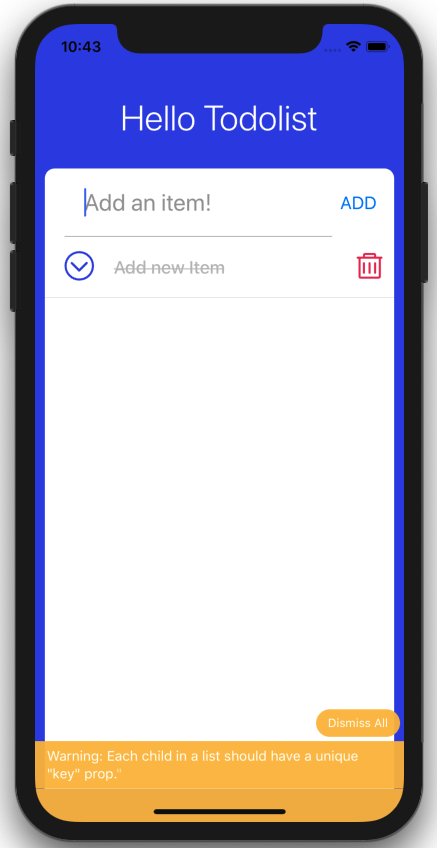

### Adding items

We are going to add feature to add todo items.

Let's create a function to add an item using `setTodos`

```js
const addTodo = text => {
    setTodos([
      ...todos,
      {id: Math.random().toString(), textValue: text, checked: false},
    ]);
  };
```

We created addTodo function which gets text as an argument and then add a new item object. id will be generated randomly and checked will be false by default. text that you get will be set on textValue. setTodos function update the state keeping previous ones.

Basically props are used to pass data from component to component. We will transfer this function through props to the TodoInsert component.

```js
<TodoInsert onAddTodo={addTodo} />
```

In TodoInsert component we can retrieve this function as below.

```js
const TodoInsert = ({onAddTodo}) => {
  ...
}
```

To get the text value from TextInput, we need to handle the state of text value. So we are going to use `useState` again to handle the text value entered by user. 

```js
// components/TodoInsert.js
import React, {useState} from 'react';

const TodoInsert = ({onAddTodo}) => {
  const [newTodoItem, setNewTodoItem] = useState('');
...
}
```

Text value will be a string so pass `''` as initial state for our variable.

Let's create a handler to change the state of text value in real time.

```js
const todoInputHandler = newTodo => {
    setNewTodoItem(newTodo);
  };

...
    <View style={styles.inputContainer}>
      <TextInput
        style={styles.input}
        placeholder="Add an item!"
        placeholderTextColor={'#999'}
        onChangeText={todoInputHandler}
        value={newTodoItem}
        autoCorrect={false}
      />
...
```

We also added a property `onChangeText` in TextInput and put `todoInputHandler` in it. And added a property `value` in TextInput and put `newTodoItem` in it. So now if you enter words on the text input the state of text value will be updated in real time and we will get the value as latest one.

Now we will create a handler for adding items.

```js
const addTodoHandler = () => {
    onAddTodo(newTodoItem);
    setNewTodoItem('');
  };

...

      <View style={styles.button}>
        <Button title={'ADD'} onPress={addTodoHandler} />
      </View>
...
```

`addTodoHandler` includes `onAddTodo` and `setNewTodoItem`. `onAddTodo` will pass the text value entered by user to the addTodo function and `setNewTodoItem` will initialize the TextInput to blank.

If user pressed the Add button, item will be added. Button provides a basic button component. We applied `onPress` Event on button and calling `addTodoHandler()` function, when user clicks on button.

### TodoList

To list the added items, we will pass items to TodoList and TodoItem component.

In app.js file, pass the `todos` to TodoList component.

```js
<TodoList todos={todos} />
```

`todos` is an array including objects of todo items so we will pass the each item to TodoListItem component using map function.

```js
const TodoList = ({todos}) => {
  return (
    <ScrollView contentContainerStyle={styles.listContainer}>
      {todos.map(todo => (
        <TodoListItem {...todo} />
      ))}
    </ScrollView>
  );
};
```

We pass items using destructuring syntax so that we can directly receive the values in item object.

Each item has values with keys such as textValue, id, checked.

In TodoListItem component, we can get the values from props. Now let's put the textValue on Text area.

```js
const TodoListItem = ({textValue, id, checked}) => {
  return (
    <View style={styles.container}>
      <TouchableOpacity>
          ...
      </TouchableOpacity>
      <Text style={[styles.text, styles.strikeText]}>{textValue}</Text>
      <TouchableOpacity style={styles.buttonContainer}>
          ...
      </TouchableOpacity>
    </View>
  );
};
```

If you add a new item and you can see the item added on the list.



However, you may see the warning on the bottom of the screen. It says `Each child in a list should have a unique 'key' prop.` Thats why we have a key in each item object.

Let's go back to the TodoList component and add a key props to TodoListItem.

```js
<ScrollView contentContainerStyle={styles.listContainer}>
      {todos.map(todo => (
        <TodoListItem key={todo.id} {...todo} />
      ))}
</ScrollView>
```

Now you can see there is no more warning.

