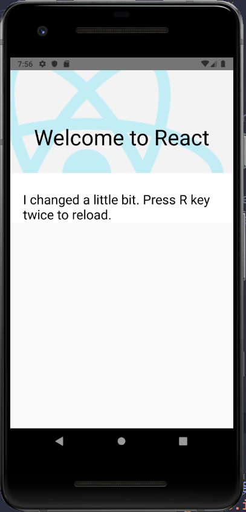

# 리액트 네이티브의 추가적인 기본 기능 배우기 

# React Native CLI 빠르게 시작하기 

디버깅 챕터를 위한 기본적인 셋팅 안내입니다.
만약 모든 아래 dependencies 를 설치한 상태라면 바로 디버깅 챕터로 이동하셔도 좋습니다.


__개발 OS:__ 윈도우

__목적 OS:__ 안드로이드

## 필요 Dependencies 설치하기 

필요한 것: __Node, Python2, JDK__

(노드는 최신 버전 node 8.3 혹은 그 이상, JDK는 버전 8 혹은 그 이상으로 설치해주세요)
 
1. 노드와 Python2를 설치하는 것을 추천합니다 (Chocolatate 이용 설치) [Chocolatatey](https://chocolatey.org/courses/installation/installing?method=installing-chocolatey)

2. 관리자로 CMD 창을 실행시켜 주세요 (CMD 창을 오른쪽 클릭하시고 "관리자로 실행하기"를 눌러주세요), 
    그런 다음, 다음 명령어를 실행시켜 주세요:

         choco install -y nodejs.install python2 jdk8 

    

3. The React Native Cli 설치

            npm install -g react-native-cli

    

## 안드로이드 개발 환경 

안드로이드 개발 환경에 익숙하신 상태라면 건너뛰어도 좋습니다 

1. 안드로이드 스튜디오 설치 
    1. 'Custom(맞춤)' 설치 선택 (설치 타입)
    2. 다음 사항들을 선택하세요 
        + Android SDK
        + Android SDK Platform
        + Performance (Intel HAXM)
        + Android Virtual Device

2. Android SDK 설치


   `Android 9 (Pie)` SDK 로 하는 것이 좋습니다 
   
   
    1. `Configure` 선택
   
   2. `SDK Manager` 선택

    아니면 SDK Manager를 "Preferences" 대화창에서 선택할 수 있습니다.
    Apprearance & Behavior → System Settings → Android SDK 아래에 있습니다.

    3.  `SDK Platforms` 탭을 SDK Manager 에서 선택하세요.
    
    4. 오른쪽 밑의 `Show Package Details` 옆의 체크 박스를 선택하세요.

    5. `Android 9 (Pie)` entry 확장하기

    6. 다음 사항들이 체크되어 있는지 확인하기
        + `Android SDK Platform 28`
        + `Intel x86 Atom_64 System Image` 또는 `Google APIs Intel x86 Atom System Image`

    7. `SDK Tools` 탭 선택하고 `Show Package Details` 옆의 박스를 체크하세요.
    
    8. `Android SDK Build-Tools` entry를 확장시키고 `28.0.3` 가 체크되어 있는지 확인하세요. 

    9. 다운로드를 위해서 `Apply`를 클릭하고 Android SDK 와 related build tools를 설치하세요.


        

3.  ANDROID_HOME 환경변수 구성하기 

    + 시스템 창을 열고 `시스템과 보안` 열기
    + New(생성) 선택하기
    + `고급` 탭을 열고 and `환경 변수` 선택하기 
    + New(생성) 선택하기 

    다음 경로를 복사하고 붙여 넣으세요 

    ```c:\Users\YOUR_USERNAME\AppData\Local\Android\Sdk```

    + cmd열어서 새로운 환경변수가 로드되었는 지 확인하기
    + SDK 위치는 `Appearance &Behavior` > `System Settings` > `Android SDK` 밑에 Android Studio `Preferenced`에 있습니다.

4. 경로에 platform-tools 추가하기

    + 시스템과 보안 창 밑의 시스템 창 열기
    + 환경설정 변경 클릭하기 
    + 고급 탭을 열고 환경 변수 클릭하기
    + Path 변수를 선택하고 편집 클릭하기 
    + 새로 path 와 platform-tools 를 경로에 추가하기

    기본 경로 위치:

    ```c:\Users\YOUR_USERNAME\AppData\Local\Android\Sdk\platform-tools```

5. 새로운 어플리케이션 설치하기 

            react-native init my_first_project

    그러면 이렇게 어플리케이션을 실행시킬 수 있게 됩니다. 

    

6. 안드로이드 디바이스 비교하기 

    실제 디바이스, 가상의 안드로이드 디바이스 둘 다 사용할 수 있습니다.

    1. 실제 디바이스 사용하기 
        USB 케이블 사용해서 컴퓨터에 연결하기 

    2. 가상 디바이스 사용하기  
       + 열기 `./my_first_project/android

        

       + "AVD Manager"을 열어서 사용가능한 안드로이드 가상 디바이스(AVD)의 목록을 확인할 수 있습니다.
        

     
       안드로이드 스튜디오를 막 설치했다면, 새로운 AVD를 만들어야 할수도 있습니다.

       + `Create Virtual Device` 선택

         

       + 리스트에서 원하는 것 선택하고 `Next` 클릭

         

       + `Pie API Level 28 image` 클릭하기 

            

       + `Next` 후 `Finish` 클릭하기

       + 초록색 세모버튼을 클릭해서 AVD를 실행시킬 수 있습니다

            
       
        
        


    7. 리액트 네이티브 어플리케이션 실행시키기

     ```
        cd my_first_project
        react-native run-android
     ```

    

    8. 앱 변경해보기

        + `App.js`을 텍스트편집기에서 열고 몇 줄을 수정해보세요.
         
        + `R`키를 두 번 누르거나 개발자 메뉴에서 `Reload` (`Ctrl + M`)를 누르면 변화를 볼 수 있습니다. 

    저는 app.js에서 다음과 같이 몇 줄을 바꾸어보았습니다.

            <View style={styles.body}>
                <View style={styles.sectionContainer}>
                <Text style={styles.sectionTitle}>I changed a little bit.
                Press R key twice to reload. 
                </Text>

                </View>
            </View>
        
    


# 다음 장으로 넘어가세요

- [디버깅 시작하기](../02-debugging/debugging-kr.md)
- [사용자 환경 UI 개선하기](../03-improve-user-interface/improve-user-interface.md)

# Source
[React Native 공식 페이지](https://facebook.github.io/react-native/docs/getting-started)