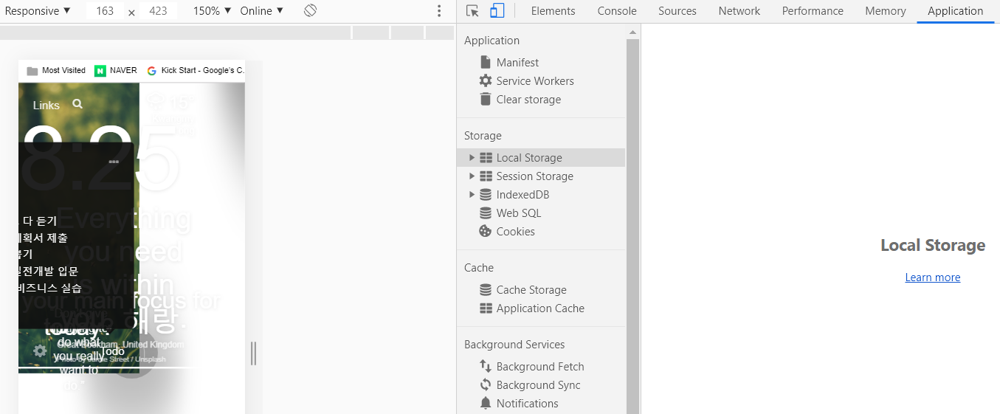

# Debugging

## Enabling keyboard shortcuts 

+ ios (Requirement)
    + Open Hardware menu, select Keyboard, and make sure that "Connect Hardware Keyboard" is checked

## Accessing the In-App Developer Menu

+ You can acess the develop menu
    1. Shake your device or select "Shake Gesture" inside the Hardware menu (iOS Simulator)

    2. Keyboard shortcut 
        + `⌘D` (iOS emulator)
        + `⌘M` (Android emulator, Mac OS)
        + `Ctrl+M` (Windows, Linux)
        + Use command `adb shell input keyevent 82` to open the dev menu (82 being the Menu key code, Android)

    ``` The Developer Menu is disabled in release (production) builds.```

    + Open In-App Developer menu and Select **Toggle Selector** 

    
    
    + Inspector lets you tap on any UI element and see information about it


    

    + Open In-App Developer menu and select Debug 

     

    
    


# React Developer Tools

We are going to use the [standalone version of React Developer Tools](https://github.com/facebook/react/tree/master/packages/react-devtools)


            npm install -g react-devtools


Run `React-devtools`

        react-devtools

Upgrade **React-devtools** according to **your React Version**

        


Added *"devtools": react-devtools* to package.json file


            npm run devtools


# Integration with React Native Inspector

1. Open the in-app developer menu and choose "Toggle Inspector" again

It uses DevTools as primary UI this time 

2. Click on something in the simulator, it brings up the relevant components in the DevTools

When I choose Text contents, it shows: 


When I choose *Welcome to React*, it shows: 


# Inspecting Component Instances

You can inspect the props and state of the React components in the browser console

 + Make sure that there is debuggerworker.js in dropdown, Chrome console (Essential)

    

 1. Select a React component in React DevTools

    

2. Select debuggerworker.js from Chrome console droplists

     

 3. When you select it, it will be available as `$r` in the Chrome console (lets you inspect its props, state, and instance properties) 

    


 
   


# Chrome Developer Tools (To Debug)

`Note: the React Developer Tools Chrome extension does not work with React Native, but you can use its` [standalone version](debugging.md#React-developer-tools)


+ Select `Debug JS Remotely` from the Developer Menu [http://localhost:8081/debugger-ui.](http://localhost:8081/debugger-ui.)


+ Select `Tools → Developer Tools` from the Chrome Menu to open the `Developer Tools.`

+ Keyboard shortcuts
 + `⌘⌥I` (macOs)
 + `Ctrl+Shift+I` (Windows)

 

+ Step further [Pause On Caught Exceptions](https://stackoverflow.com/questions/2233339/javascript-is-there-a-way-to-get-chrome-to-break-on-all-errors/17324511#17324511)


# Safari Developer Tools

 You can debug the iOS version of your app without having to enable `Debug JS Remotely`

 + `Preferences → Advanced → Select "Show Develop menu in menu bar` 
 + Select JS Context: `Develop → Simulator → JSContext` 
 + Safari's Web Inspector should be opened which has a Console and a Debugger 

 ### Disadvantages

 1. No sourcemaps when debugging
 2. Everytime the app is reloaded (Using live reload, or by manually reloading), a new JS Context is created.
 3. Choosing `Automatically Show Web Inspectors for JSContext` saves you from having to select the latest JSContext manually.


# In-app Errors and Warnings

Errors and warning are displayed inside your app in development builds

## Errors

In-app erros are displayed in a full screen alert with a red back inside your app (known as a Red Box)

You can use `console.error()` to manually trigger one.

## Warnings

Warnings will be displayed on screen with a yellow background(known as a Yellow Box)

+ Show more information (Click on the alerts or to dismiss them)

You can use `console.warn()` to trigger a YellowBox

+ Disable YellowBoxes during development
 
    `console.disableYellowBox=true;` 

+ Specific warnings can be ignored programmatically by setting an array of prefixes that should be ignored

    ``` 
    import {YellowBox} from `react-native`;
    YellowBox.ignoreWarnings(['Warning: ...']);
    ```

+ CI/Xcode 
    YellowBoxes can be disabled by setting `IS_TESTING` environment variable

 RedBoxes and YellowBoxes are automatically disabled in release (production) builds

 # Go To Other Chapters

- [Basic Settings to start react-native Project](../01-basic-setting/basic-settings.md)
- [Improve-user-interface](../03-improve-user-interface/improve-user-interface.md)

# Source

[React Native Official Page - Debugging](https://facebook.github.io/react-native/docs/debugging#reloading-javascript)


