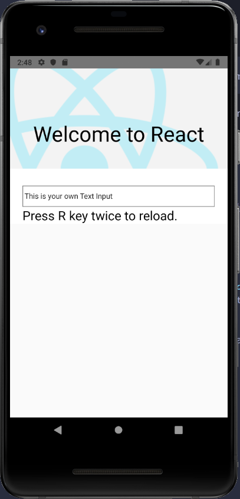
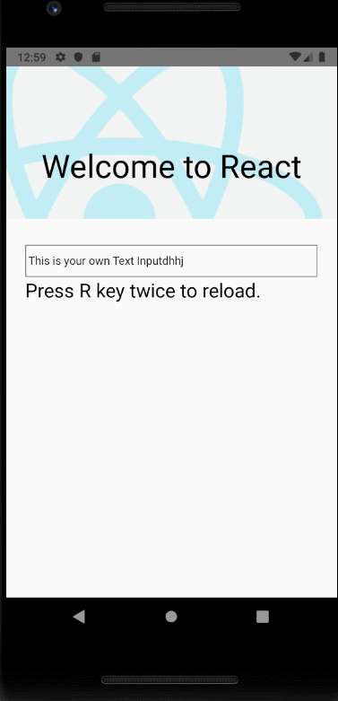

# 텍스트 입력창 만들기

  1.  *TextInput.js* 파일을 만든다 (이 예제에서는 app.js와 같은 경로에 만들었다)

     
         import React, { Component } from 'react';
         import { TextInput } from 'react-native';

          export default function UselessTextInput() {
            const [value, onChangeText] = React.useState('This is your own Text Input');

            return (
              <TextInput
                style={{ height: 40, borderColor: 'gray', borderWidth: 1 }}
                onChangeText={text => onChangeText(text)}
                value={value}
              />
            );
          }

  2. `app.js`에서 `textInput.js`를 가져온다.

          import TextInput from './TextInput';

      

  3. 안드로이드 에뮬레이터를 리로드 한다.

      

# *Keyboard Avoiding View* 만들기 

  < *Keyboard Avoiding View* >

  1. 이 컴포넌트는 화면 내 뷰들이 가상 키보드의 경로에서 벗어나게 만들어준다.

  2. 키보드의 위치에 따라서 높이, 위치, 바닥 패딩을 자동적으로 조절해준다. UI가 한 화면에 많을 경우 유용하다.

          import {KeyboardAvoidingView} from 'react-native';

          <KeyboardAvoidingView style={styles.container behavior="padding" enabled>
            ... your UI ...
          </KeyboardAvoidingView>;

  ## 예제

  1. *TextInput.js* 파일에서 *KeyboardAvoidingView*를 가져온다.
  
      

  2. *TextInput UI*를 *KeyboardAvoidingView*로 감싼다. 

      

  3. 예제 화면 

      

# 터치 영역 확장시키기 

모바일 환경에서 버튼을 정확하게 누르기 힘든 경우가 있다.

+ 모든 상호작용하는 요소들을 44X44 또는 더 크게 한다.

+ element, padding, minweight, minheight
변수의 스타일 값을 위해서 충분한 공간을 남겨놓는다

+ 대신에 `hitSlop prop `을 사용해서 레이아웃에 영향을 주지 않고 인터렉티브(상호작용기능)를 향상시킬 수 있다.

  [소스코드 출처](https://snack.expo.io/rJPwCt4HZ)

  이 예제를 엑스포 없이 간단히 실행시켜보고 싶다면 전체 코드에서 다음 코드를 삭제하면 된다.

        import { Constants } from 'expo';
        paddingTop: 20 + Constants.statusBarHeight,
  
  

  ## 소스코드 실행시키는 법(직접 작성해보는 경우)

        react-native run-android

  혹은

  ## 예제 프로젝트 실행시키는 법
            
        cd Examples/BasicTutorial/BasicFeatues/wide_your_tap
        react-native run-android

  

 # 다른 챕터 살펴보기 

- [Basic Settings to start react-native Project](../01-basic-setting/basic-setting-kr.md)
- [Debigging](../02-debugging/debugging-kr.md)
 
 # 출처

 [리액트 네이티브 공식 페이지](https://facebook.github.io/react-native/docs/improvingux)

    