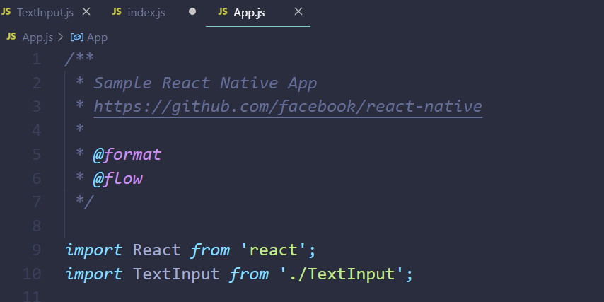

# Make Your Text Input 

  1. Make *TextInput.js* file (I made it at the same path with app.js and index.js)

     
         import React, { Component } from 'react';
         import { TextInput } from 'react-native';

          export default function UselessTextInput() {
            const [value, onChangeText] = React.useState('This is your own Text Input');

            return (
              <TextInput
                style={{ height: 40, borderColor: 'gray', borderWidth: 1 }}
                onChangeText={text => onChangeText(text)}
                value={value}
              />
            );
          }

  2. Import `textInput.js` from `app.js`

          import TextInput from './TextInput';

      

  3. Reload your Android emulator 

      

# Make *Keyboard Avoiding View*

  < *Keyboard Avoiding View* >

  1. This component makes views to move out of the way of the virtual keyboard.

  2. It adjusts its height, position, or bottom padding based on the position of the keyboard automatically.

          import {KeyboardAvoidingView} from 'react-native';

          <KeyboardAvoidingView style={styles.container behavior="padding" enabled>
            ... your UI ...
          </KeyboardAvoidingView>;

  ## Example

  1. Import *KeyboardAvoidingView* from *TextInput.js* file
  
      

  2. Surround your *TextInput UI* with *KeyboardAvoidingView*

      

  3. Example Screen

      

# Make tappable areas larger

It's very hard to be very precise when pressing buttons.

+ Make sure all interactive elements are 44x44 or larger

+ Leave enough space for the element, padding, minWidth and minHeight style values(It can be useful).

+ Instead, You can use `hitSlop prop ` to increase interactive area without affecting the layout.

  [Code source](https://snack.expo.io/rJPwCt4HZ)

  If you want to execute this without using expo, you can remove these codes.

        import { Constants } from 'expo';
        paddingTop: 20 + Constants.statusBarHeight,
  
  from above source code.

  ## Run your source code 

        react-native run-android

  or

  ## Run Example Projects
            
        cd Examples/BasicTutorial/BasicFeatues/wide_your_tap
        react-native run-android

  

 # Go To Other Chapters

- [Basic Settings to start react-native Project](../01-basic-setting/basic-setting.md)
- [Debigging](../02-debugging/debugging.md)
 
 # source

 [React Native Official Page](https://facebook.github.io/react-native/docs/improvingux)

    