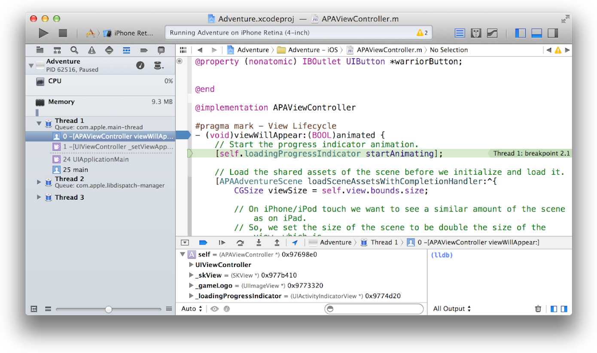
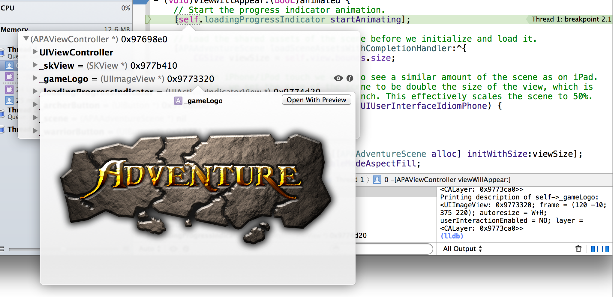
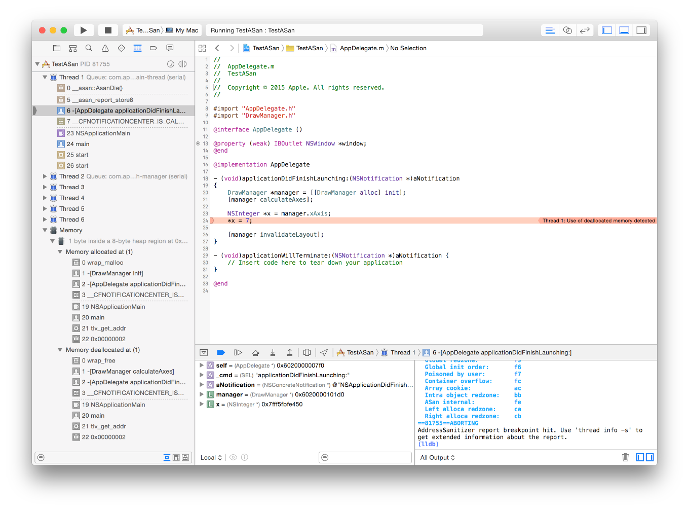
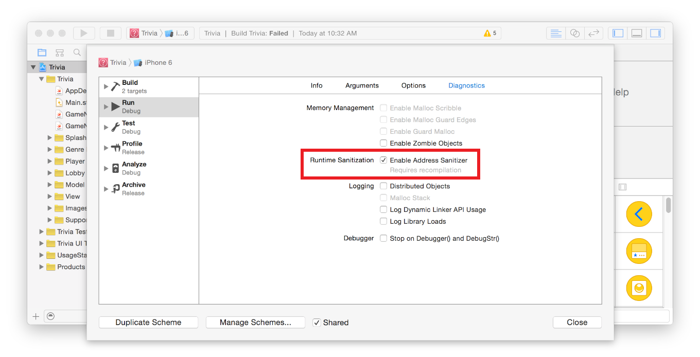
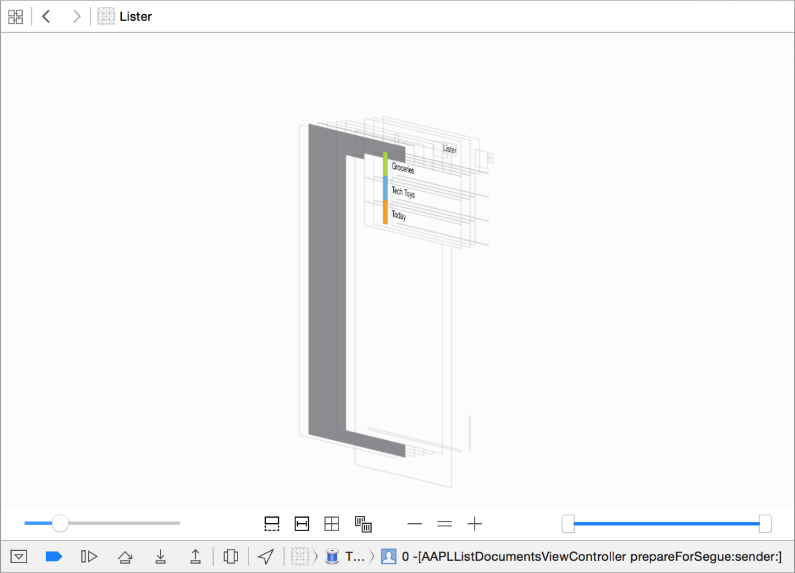
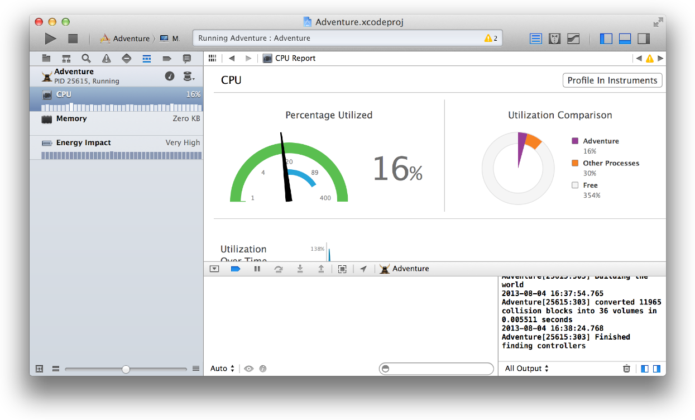
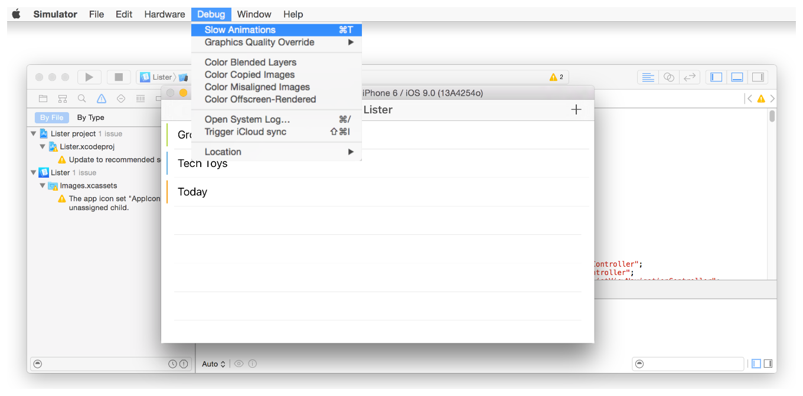
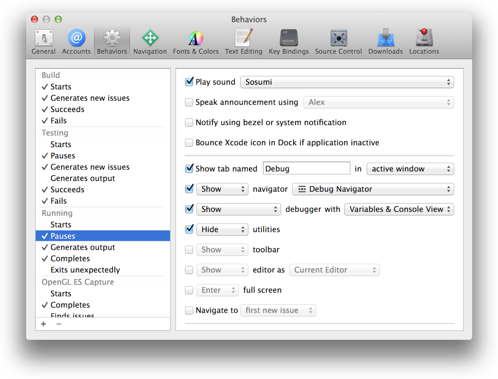

## 1. 디버거 사용하기

워크스페이스의 툴바에서 실행 버튼을 누르면 앱은 성공적으로 빌드될 것입니다. Xcode는 앱을 실행시키고 디버깅 세션을 시작합니다. `data tips` 같은 그래픽 툴이나 [Quick Look](<https://developer.apple.com/library/archive/documentation/DeveloperTools/Conceptual/debugging_with_xcode/chapters/quick_look_data_types.html>)을 제공하는 소스 에디터에서 앱을 직접 디버깅할 수 있습니다. 

디버그 영역과 탐색기는 당신이 실행하고 있는 앱의 현재 상태를 검사하도록 하고 그것의 실행을 통제하도록 합니다. 

질적인 앱을 만드려면 유저 시스템에 앱이 끼치는 영향을 최소화해야 합니다. 디버그 탐색기 안에 있는 디버그 게이지를 사용하여 앱의 리소스 소비에 대해 인사이트를 얻어보세요. 그리고 문제를 발견했을 때 앱의 성능을 분석하고 측정하기 위해 도구를 사용하세요. 

만약 iOS나 watchOS 앱을 개발하고 있다면 조기 테스트나 디자인을 하는 동안 발생하는 주요 문제를 찾기 위해 시뮬레이터를 사용하세요. 

Xcode가 디버깅 문제에 대해 포커싱하도록 도와준다는 것을 알게될 것입니다. 예를 들어서 당신의 코드가 브레이크 포인트에 도달했을 때 당신은 Xcode가 자동적으로 알람을 울리게 하고 디버그 영역, 탐색기, 코드의 브레이크 포인트를 표시하는 새로운 디버그 윈도우 창을 띄울 수 있습니다. 

### 실행을 컨트롤하기

Xcode를 사용하면 특정 실행 단계에서 프로그램 상태를 보기 위해 코드 라인을 단계별로 살펴볼 수 있습니다. 디버거와의 상호작용, 콘솔 출력 및 프로그램 변수와 레지스터 보기, 코드의 실행제어를 위해서 디버그 영역을 사용하세요. 또한 당신은 디버그 영역을 사용하여 특정한 호출에서의 렌더링 상태 정보를 보거나 프레임을 렌더링하는 OpenGL 호출을 탐색할 수 있습니다. 

워크스페이스 윈도우 툴바에서 뷰 셀렉터의 중앙 버튼 ()을 클릭하여 디버그 영역을 표시하세요. 

디버그 영역 툴바에서 일시정지 버튼(일시정지 버튼  과 실행 버튼 을 토글하는)을 클릭하여 앱의 실행을 중단시킬 수 있습니다. 브레이크 포인트를 설정하기 위해서는 소스코드 파일을 열고 당신이 실행을 멈추고 싶은 라인 옆의 홈통을 클릭하세요. 홈통의 파란색 화살표()는 브레이크 포인트를 가리킵니다. 브레이크 포인트 액션이나 다른 종류의 브레이크 포인트에 대해 더 알고 싶으면 [Xcode Help](https://help.apple.com/xcode)를 참고하세요. 

일시정지했을 때에 현재 실행되고 있는 라인의 코드는 녹색으로 하이라이트됩니다. 스텝오버 (Step Over, ), 스텝인투(Step Into, ), 스텝아웃(Step Out) 행동을 사용하여 코드를 단계적으로 실행할 수 있습니다. Step Over는 어떤 메서드가 포함되어 있든지 코드의 현재 라인을 실행할 것입니다. 만약 코드의 현재 라인이 메서드를 호출한다면 Step into는 현재 라인을 실행하고 호출된 메서드의 첫줄에 도달하면 정지합니다. Step out은 나머지 메서드나 함수를 실행합니다.

### 상태 정보 보기

실행이 중지되면 디버그 탐색기가 열려 스택 추적을 표시합니다. 편집기 영역과 디버그 영역에서 항목에 대한 정보를 보려면 디버그 탐색기에서 항목을 선택하세요. 디버깅할 때 스택 프레임을 표시하거나 숨기려면 스레드를 확장하거나 축소하세요.

소스 코드 에디터의 변수 위에 마우스를 올려 놓으면 변수 값이 표시된 데이터 팁이 표시됩니다. 변수 옆의 점검 아이콘 ()을 클릭하여 디버그 영역 콘솔에 객체의 Objective-C 설명을 출력하고 설명을 표시하기 위한 추가적인 팝업을 띄워보세요.

Quick Look 아이콘()을 클릭하여 변수 내용의 그래픽 표시를 확인하세요. 당신만의 객체를 위한 커스텀 Quick Look 표시를 구현할 수 있습니다. Xcode 디버거의 커스텀 타입을 보려면 [Quick Look](<https://developer.apple.com/library/archive/documentation/DeveloperTools/Conceptual/debugging_with_xcode/chapters/quick_look_data_types.html>)을 참고하세요.

### 메모리 손상 찾기

메모리 손상은 재현하기 어려울 수 있고 찾기는 더 어려울 수 있습니다. 주소 sanitizer는 Xcode가 손상 발생 시 앱을 중지할 수 있도록 하는 도구를 앱에 추가합니다. 주소 sanitizer는 할당된 포인터 엑세스, 버퍼 오버플로우 및 스택과 힙의 언더플로우, 그리고 다른 메모리 이슈들을 찾아냅니다. 

주소 sanitizer을 사용하려면 대상을 위한 디버그 스키마에서 사용하도록 설정한 뒤 앱을 실행하고 사용하세요. Xcode는 메모리 사용을 모니터링하고 문제를 일으키는 코드 라인에서 앱을 중지하고 디버거를 엽니다. 원인을 분리하려면 디버거를 사용하세요.

주소 sanitizer를 사용하는 데 더 많은 정보가 필요하면 [Using the Address Sanitizer](https://developer.apple.com/library/archive/documentation/DeveloperTools/Conceptual/debugging_with_xcode/chapters/special_debugging_workflows.html#//apple_ref/doc/uid/TP40015022-CH9-SW23)를 참고하세요.

### Metal 디버깅하기

Metal 최신 GPU를 최대한 활용하여 앱이 최상의 사용자 경험을 제공할 수 있도록 합니다. 당신은 Metal을 사용함으로써 향상된 API를 사용하여 그래픽과 게산을 더 빠르게 할 수 있습니다. Metal 디버깅에 대해 더 많은 정보가 필요하면  [Metal Tips and Techniques](https://developer.apple.com/library/archive/documentation/Miscellaneous/Conceptual/MetalProgrammingGuide/Dev-Technique/Dev-Technique.html#//apple_ref/doc/uid/TP40014221-CH8)을 참고하세요. 더 일반적인 정보를 원하면 Metal 프로그래밍 가이드와 [Metal for Developers](https://developer.apple.com/metal/) 웹사이트를 참고하세요.

### OpenGL 디버깅하기

연결된 장치에서 OpenGL ES앱을 빌드하고 실행할 때에는 디버그 영역 툴바는 프레임 캡처 버튼()이 생깁니다. 프레임을 캡처하려면 버튼을 클릭하세요. OpenGL ES 프레임을 아래와 같은 사항을 캡처하고 싶을 때 사용할 수 있습니다. 

- OpenGL ES 상태 정보를 점검
- 뷰 텍스쳐 및 쉐이더와 같은 OpenGL ES 객체를 검사
- 각 호출의 변화를 확인하고 각 draw call을 진행하는 상태 호출을 단계별로 진행
- 어떻게 이미지가 구성되는지 정확히 알기 위해 draw call을 단계적으로 진행
- 보조 에디터에서 각 draw call에 의해 사용되는 각 객체들을 확인
- 앱에 끼치는 영향을 확인하기 위해 쉐이더들을 편집

스크린샷은 디버거를 사용하여 렌더링된 프레임의 구성 요소를 보는 방법을 보여 줍니다. 왼쪽의 디버그 탐색기는 렌더링 트리의 일부를 표시하며, 기본 디버그 보기는 다른 이미지 소스뿐만 아니라 렌더링된 프레임의 색상 및 깊이 소스를 보여줍니다. 

OpenGL ES 디버깅에 대해 더 많은 정보를 얻고 싶으면 [Xcode Help](https://help.apple.com/xcode)에서 관련된 아이템을 찾아보세요. 

## 2. 뷰 계층 검사하기

디버그 영역 맨 위의 바에 있는 디버그 뷰 계층 버튼()을 클릭하세요. 일시 중지된 앱의 뷰 계층에 대한 3D 렌더링을 검사할 수 있습니다. 아래와 같은 사항을 할 수 있습니다. 

- 캔버스를 클릭, 드래그하여 렌더링을 회전
- 왼쪽 하단의 슬라이더를 사용하는 뷰 레이어 사이의 공간을 늘리거나 줄임
- 오른쪽 하단의 슬라이더를 사용하여 가시적 뷰 범위를 변경합니다. 맨 아래 보이는 보기를 변경하려면 왼쪽 핸들을 이동시킵니다. 오른쪽 핸들을 이동시켜 맨 위에 보이는 보기를 변경합니다.
- 잘라낸 내용 표시 버튼 ()을 클릭하여 선택한 보기의 잘린 내용을 표시합니다.
- 보기 제약조건 버튼()을 클릭하여 선택한 보기의 자동 레이아웃 제약조건을 표시합니다. 
- 확대(+) 버튼, 축소(-) 버튼을 사용하여 배율을 늘리거나 줄입니다.

디버깅 뷰에 대한 더 많은 정보를 얻고 싶으면 [Debugging View Hierarchies](https://developer.apple.com/library/archive/documentation/DeveloperTools/Conceptual/debugging_with_xcode/chapters/special_debugging_workflows.html#//apple_ref/doc/uid/TP40015022-CH9-SW2)를 참고하세요.

## 3. 시스템 임팩트 검사하기

디버그 탐색기는 앱의 작동 방식에 대해 인사이트를 제공하는 게이지를 표시합니다. 예를 들어 CPU 게이지에 앱의 CPU 사용량이 표시되므로 예상치 못한 스파이크를 쉽게 발견할 수 있습니다. 앱의 기능과 대상의 특성에 따라 앱이 메모리, iCloud, OpenGL ES, Energy 및 CPU에 미치는 영향을 게이지가 보고할 수 있습니다.

완전한 리포트를 보기위해서는 디버그 영역의 게이지를 클릭하세요. 앱의 수행 성능에 대한 더 깊은 분석을 위해서는 도구 버튼의 Profile을 클릭하세요.

문제 영역의 에너지 리포트는 앱에 문제가 있을 수 있는 사항에 대한 예비 진단을 제공합니다. 

더 많은 정보를 얻으려면 Using Debug Gauges를 참고하세요. 

## 4. 성능 측정하기

Xcode에 포함되어있는 Instruments(측정 도구들. 영어로 측정 기구, 기계를 뜻함) app은 실행중인 앱에서 데이터를 모으고, 그래픽 시간순서로 모아진 데이터를 보여줍니다. 측정 도구들로 앱의 메모리 사용량, 디스크 활동, 네트워크 활동, 그래픽 연산과 같은 성능 측면에 대한 데이터를 얻을 수 있습니다. 또한 데이터를 함께 봄으로써, 앱의 성능을 개선할 수 있는 잠재적안 부분을 명확히파악하는 등 다양한 측면을 분석하는 것이 가능합니다. IOS 앱안의 UI 요소 테스트들을 자동화할 수도 있습니다.

Xcode에서 성능 측정 도구들을 시작하는 여러 가지 방법이 있습니다. 

- 디버그 게이지 리포트에서 Instruments 버튼 안의 Profile을 클릭합니다.
- Product → Profile을 클릭합니다.
- Scheme에 Profile 활동 안의 Instrument를 명시합니다.

Intruments app은 앱의 실행 과정 전체의 데이터를 모으는 데이터 수집 모듈들을 사용할 수 있습니다. Instruments앱은 템플릿들을 포함하고 있고, 각 템플릿은 연관된 정보의 얻는데 사용되는 Instrument들을 포함합니다. 다음 사진은 Instruments 앱을 시작할 때 보여지는 템플릿 모음을 보여주고 있습니다.

앱을 실행하고 난 후에, Instruments 창은 각 Instrument에 대한 모든 데이터를 보여주고, 이 데이터들을 둘러보는 많은 방법들을 제공한다.

좀 더 자세한 정보를 위해서는, [Performance Overview](https://developer.apple.com/library/archive/documentation/Performance/Conceptual/PerformanceOverview/Introduction/Introduction.html#//apple_ref/doc/uid/TP40001410) 와 [Instruments User Guide](https://developer.apple.com/library/archive/documentation/DeveloperTools/Conceptual/InstrumentsUserGuide/index.html#//apple_ref/doc/uid/TP40004652)를 참고하세요.

## 5. 시뮬레이터에 관련된 문제들

시뮬레이터는 디자인과 초기 테스트를 하는 동안 앱에서 문제점들을 찾을 수 있게 도와줍니다. 예를 들어 시뮬레이터의 Debug 메뉴는 다음과 같은 도구들을 제공하고 있습니다.

- 앱 안의 에러들을 발견하기 위해 앱의 실행 속도를 느리게 합니다.
- 그래픽 퀄리티를 변경할 수 있습니다.
- iCloud 동기화를 시작합니다.
- 앱 성능에 해가 되는 복잡한(혼합된) view 레이어들을 명확히 알려줍니다.
- 이미지 소스 픽셀들이 제대로 정렬되지 않은 이미지들을 명확히 알려줍니다.
- 화면에 렌더링되는 콘텐츠를 보여줍니다.
- 다른 위치에서 가상으로 앱을 실행합니다.

시뮬레이터 내의 모든 가상 환경에서, 홈 스크린은 IOS또는 watchOS 장비의 앱들(세팅, 연락처, 지도, 결제 정보와 같은 것)에 대한 접근 권한을 제공합니다다. 시뮬레이터에서 이러한 정보들을 이용한 앱의 예비 테스트를 수행할 수 있습니다. 예를 들어, 만일 게임을 테스트한다면, 게임이 게임 센터를 정확하게 사용하는지 테스트하기 위해 시뮬레이터를 이용하면 됩니다.

시뮬레이터에서 Inspector는 앱 안에서 접근할 수 있는 각 요소에 대한 정보를 게시함으로써, 사용자의 제한이나 장애에 관계 없이 앱의 이용성을 테스트하는 것을 돕습니다. inspector는 장애 요소들을 포함한 상태로 VoiceOver가 잘 작동하는지 테스트할 수도 있습니다. Inspector를 시작하기 위해서는 시뮬레이터에서 Home 버튼을 누르세요. Setting을 누르고 General > Accessibility를 클릭하고, Inspector 접근을 On으로 밀어서 활성화하면 됩니다.

기기의 언어를 바꾸는 것을 통해 시뮬레이터의 지역화를 테스트 할 수 있습니다. 세팅에서 General > International > Language에서 변경이 가능합니다.

비록 시뮬레이터에서 앱의 기본적인 것들을 테스트할 수 있다고 할 지라도, 시뮬레이터는 다양한 이유 때문에 테스트 플랫폼으로서 제한 사항이 많습니다. 예를 들면 :

- 시뮬레이터는 기본적으로 Mac에서 동작합니다. 시뮬레이터는 컴퓨터 메모리에 접근할 수 있는데, 시뮬레이터가 사용하는  메모리는 실제 장비에서 사용하는 것보다 훨씬 많이 사용됩니다.
- 시뮬레이터는 Ios 또는 watchOS 장비의 프로세스가 아닌 Mac CPU에서 실행됩니다.
- 시뮬레이터는 실제 기기에서 실행하는 모든 스레드를 실행하지 않습니다.
- 시뮬레이터는 가속도계, 자이로스코프, 카메라 또는 근접 센서와 같은 하드웨어 기능을 실행할 수 없습니다.

앱을 개발하는 동안 지원하길 원하는 모든 장비들과 OS 버전에서 테스트하고 실행하세요.

더 많은 정보를 위해서는 [Testing and Debugging in Simulator](https://developer.apple.com/library/archive/documentation/IDEs/Conceptual/iOS_Simulator_Guide/TestingontheiOSSimulator/TestingontheiOSSimulator.html#//apple_ref/doc/uid/TP40012848-CH4)를 참고하세요.

## 6. 작업 과정 커스터마이징하기

Xcode Behaviors 환경 설정에서 작업 과정에서 중요한 작업들을 설정해보세요. 앱을 빌딩하고 실행하고, 디버깅하는 동안 다양한 이벤트가 일어날 때, 수행할 작업 과정을 설정하려면 Xcode > Behaviors 를 선택하세요.

예를 들어, Xcode는 앱의 코드가 breakpoint에서 멈출 때 debug 영역을 보여줄 수 있고, 빌드가 실패했을 때 issue navigator를 보여줄 수 있습니다.

아래의 스크린샷에서, behaviors는 code가 멈추는 시점에 일어날 작업 과정이 커스터마이징되어있는 것을 볼 수 있습니다. 커스터마이즈된 behaviors의 몇 가지 예시가 있습니다.

- 모든 일시정지 상황 때마다 경고음을 실행합니다.
- workspace 창에 debug navigator를 보여주는 Debug라는 이름의 탭을 만듭니다.
- Debug 탭에서 variables, console 화면을 모두 보여줍니다.
- Debug tab에서 uitilities 영역을 숨깁니다.

결과적으로 프로젝트 안의 코드가 breakpoint에서 멈출 때, Xcode는 명시된 컨텐츠와 함께 workspace 창 안에 debug tab을 만듭니다.

메뉴 아이템들이나 키보드 동작과 같은 것들에 의해 일어나는 사용자 지정 동작을 설계할 수도 있습니다. Xcode > Preferences를 누르고, 동작 설정 화면 메뉴를 선택한 뒤, 화면 아래의 Add 버튼을 누르세요. 새로운 사용자 지정 동작의 이름을 기입하고, Return 버튼을 누르세요. 이 동작이 호출될 때 일어날 작업들을 명확하게 설정하기 위해 체크박스를 선택하세요. 구체적인 예시를 위해 프로젝트의 스냅샷을 저장하고 유닛 테스트들을 실행하는 Unit Testing 동작을 생성해보세요. 이 동작을 만든 후, 이 동작은 Xcode > Behaviors 메뉴에서 확인할 수 있습니다.

사용자 지정 동작에 키보드 동작을 할당하려면, Xcode > Preferences 를 선택하고 Key Bingings를 선택하면 됩니다. Key Bindings preferences 화면에서 원하는 사용자 지정 동작을 찾기 위해 Customized 탭을 선택하세요. 텍스트 필드에서 텍스트 필드와 연결하길 원하는 키를 누르고 동작을 마무리하기위해 텍스트 필드 바깥을 선택하세요.

breakpoints와 breakpoint의 타입들에 대해 더 자세히 알려면 [Xcode Help](https://help.apple.com/xcode)를 참고하세요.

## 출처

1. [디버거 사용하기](https://developer.apple.com/library/archive/documentation/ToolsLanguages/Conceptual/Xcode_Overview/UsingtheDebugger.html#//apple_ref/doc/uid/TP40010215-CH57-SW1l)
2. [뷰 계층 검사하기](https://developer.apple.com/library/archive/documentation/ToolsLanguages/Conceptual/Xcode_Overview/ExaminingtheViewHierarchy.html#//apple_ref/doc/uid/TP40010215-CH58-SW1)
3. [시스템 임팩트 검사하기](https://developer.apple.com/library/archive/documentation/ToolsLanguages/Conceptual/Xcode_Overview/ExaminingSystemImpact.html#//apple_ref/doc/uid/TP40010215-CH59-SW1)
4. [성능 측정하기](https://developer.apple.com/library/archive/documentation/ToolsLanguages/Conceptual/Xcode_Overview/MeasuringPerformance.html#//apple_ref/doc/uid/TP40010215-CH60-SW1)
5. [시뮬레이터에 관련된 문제들](https://developer.apple.com/library/archive/documentation/ToolsLanguages/Conceptual/Xcode_Overview/SimulatingProblems.html#//apple_ref/doc/uid/TP40010215-CH61-SW1)
6. [작업 과정 커스터마이징하기](https://developer.apple.com/library/archive/documentation/ToolsLanguages/Conceptual/Xcode_Overview/CustomizingYourWorkflow.html#//apple_ref/doc/uid/TP40010215-CH62-SW1)