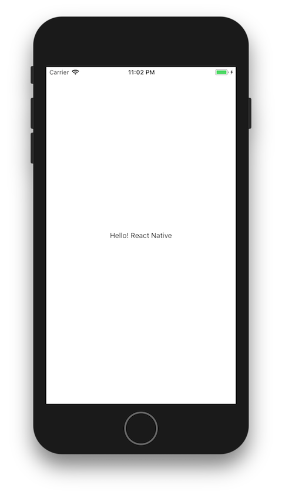

## 1. Create a New Project in Expo XDE

### expo-cli install 

[installatoin](https://docs.expo.io/versions/latest/introduction/installation/)

```
npm install -g expo-cli
```

> Expo CLI is a tool for developing apps with Expo. In addition the command-line interface (CLI) it also has a graphical UI, Expo Developer Tools, that pops up in your web browser. With Expo Dev Tools you can quickly set up your test devices, view logs and more.

### Create new project

```
expo init ReactNative-Coin-Tutorial-2019
```

### Choose some options

```sh

? Yarn v1.16.0 found. Use Yarn to install dependencies? (Y/n)  y

? Choose a template: (Use arrow keys)
  ----- Managed workflow -----
❯ blank         minimal dependencies to run and an empty root component
  tabs          several example screens and tabs using react-navigation
  ----- Bare workflow -----
  bare-minimum  minimal setup for using unimodules

  And write your app name (It will be used for home screen icon)
```

* comments may do not work on JSX area.

Done. You just made your first react native application.

### Look into the code

App.js

```js
import React from 'react';
import { StyleSheet, Text, View } from 'react-native';

export default class App extends React.Component {
  render() {
    return (
      <View style={styles.container}>
        <Text>Open up App.js to start working on your app!</Text>
      </View>
    );
  }
}

const styles = StyleSheet.create({
  container: {
    flex: 1,
    backgroundColor: '#fff',
    alignItems: 'center',
    justifyContent: 'center',
  },
});
```

### Run and Test!!

- Turn off Live reloading and edit the `Text` component in App.js
- Turn on Hot reloading and edit the `Text` component in App.js



- Change your host in XDE to `LAN` or `localhost` for faster
> If you are using LAN, make sure your device is on the same wifi network as your development machine. This may not work on some public networks. localhost will not work for iOS unless you are in the simulator, and it only work on Android if your device is connected to your machine via usb.

- Development menus
  - Android Simulator: `cmd+m`
  - iOS Simulator: `ctrl+cmd+z` or `cmd+d`
  - Genymotion(Android): `Menu` or `cmd+m`


<!-- [Source](https://github.com/JeffGuKang/ReactNative-Tutorial/commit/68e9991f3c461359041ea71badc182a4129a566c) -->