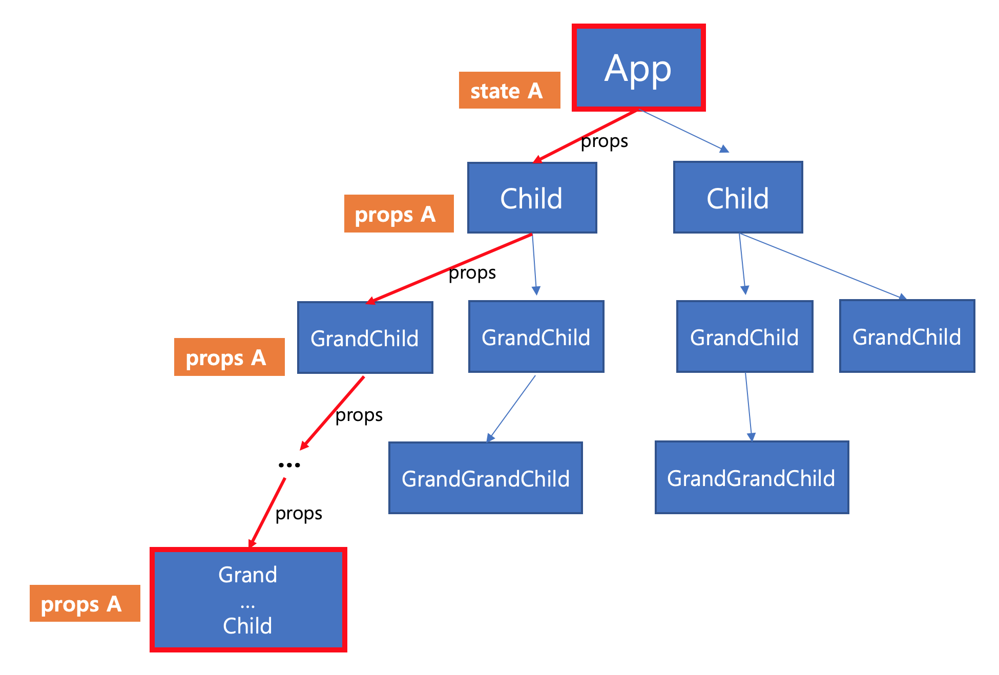

# What is Redux?

On the Formulas page, define Redux as follows:

> Redux is a state container commonly used in JavaScript applications.
 
## React vs React + Redux

### React
 > A structure that manages everything and lowers data from the parent component App.

 

 - Advantage: Intuitive and easy to manage since data management is done in one place.
 - Disadvantages: You can think of when the app grows in size.
        
      As shown above, if you think about passing it from the highest top component to the lowest Child Component as `props`, you can think of complexity.
   
### React + Redux
  >- `Redux` makes global `Store` that is located at the top of application and supplies `State` to all other components.
  >- `Store` is the place where data is managed all over the country and `Reducer`, which is a pure function that changes data values according to `Action`, is defined. 
   
  
 

## Three Principles
1. **Single source of truth**

   > Redux manages data globally from one location, and it is called `Store` where it is managed.
	
2. **State is read-only**

   > If you want to change the status, you need to create a new state and update the status you want to change without reallocating value of origin state. In other words, you must maintain the immutability of state .

3. **Changes are made with pure functions**

   > If you have the same input value, it should be written as a pure function that must have the same output value.
   

## Install redux, react-redux
Enter the following in the project terminal to install the module package.
```
npm install --save redux react-redux
```
 - **redux**
  
    > Status container for Javascript apps
    
 - **react-redux**
    
    > It provides `Provider` component and `connect` method to make it easier to develop `React + Redux`.

From now on, let's use the redux, react-redux modules to create Multiple Counters.