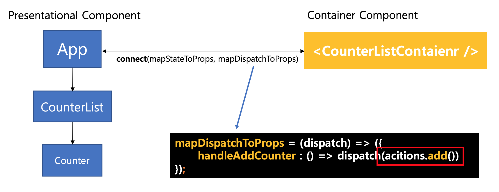

# 액션

> - 어떤 변화가 일어나야할지 알려주는 `store` 의 유일한 정보원
> - `Action` 의 이름과도 같은 `type` 이라는 필수 요소를 가진 평범한 자바스크립트 객체

## 예제

`Examples/StateManagement/ReduxTutorial/app` 에서 다음과 같이 폴더와 파일 생성하고 수정합니다.
```
$ mkdir actions
$ touch actions/ActionTypes.js actions/index.js
```

app/actions/ActionTypes.js

```
export const INCREMENT = 'INCREMENT';  
export const DECREMENT = 'DECREMENT';  
                          
export const ADD = 'ADD';  
export const REMOVE = 'REMOVE';
```
	
app/actions/index.js
```
import * as types from './ActionTypes';

export const add = () => ({
    type : types.ADD
});

export const remove = () => ({
    type : types.REMOVE,
});

export const increment = (index) => ({
    type : types.INCREMENT,
    index
});

export const decrement = (index) => ({
    type : types.DECREMENT,
    index
});
```

## 설명

### Action의 기본적인 포맷
`Action` 은 이름과도 같은 `type` 속성을 필수적으로 갖는다.
```
{
	type : "액션의 종류를 구분할 수 있는 문자열 상수",
	...
	... (상황에 따른 여러 요소 추가 가능합니다.),
	index,
	...
}
```

### Action의 사용
 - 행동 지침인 `Action`는 `dispatch()` 라는 함수를 이용하여 `Store` 에게 상태 변화를 해야한다고 알려줍니다. 
    ```
     store.dispatch({ type : "INCREMENT", index });
     ```
     위와 같이 사용할 수 있지만 보통은 이렇게 직접적으로 사용하지 않고 `action`을 반환하는 함수인 Action 생성자를 사용합니다.
     ```
     store.dispatch(() => increment(index));
     ```
 - `dispatch(action값)` 으로 상태 변화를 해야됨을 알게된 `Store` 는 `Reducer` 에 정의되어있는 메뉴얼대로 상태변화를 실행합니다.
   뒤에서 더 자세히 다루겠지만, `Reducer`는 `Action` 값에 따라서 `State` 값이 어떻게 변해야할 지 정의된 순수함수입니다.
 - `State` 를 변형하기 위해 요구되는 최소한의 정보를 나타내기 때문에 최대한 작게 유지해야합니다.
 - `Action` 에 따라 실행되는 `dispatch()` 함수는 어디서든 실행될 수 있습니다.
 - 해당 튜토리얼에서는 container Component에서 `mapDispatchToProps`이라는 함수 안에서 사용되어집니다.

    아래 사진은 액션 값이 `ADD`일 때 정의해놓은 state 변화를 실행하는 것을 callback 함수 `handleAddCounter`로 presentational 컴포넌트에 `props.handleAddCounter`으로 전달되게 하는 부분입니다.
    
    
    
